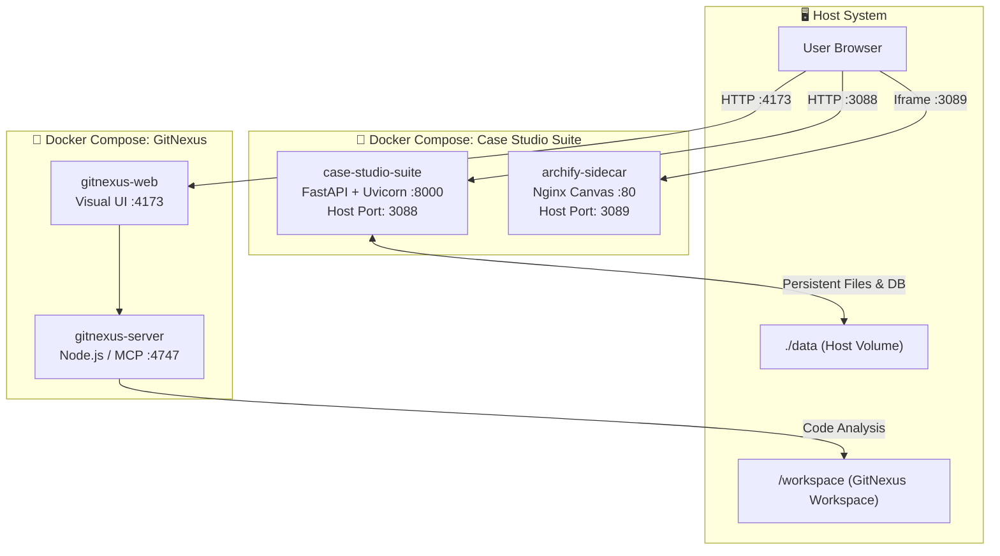
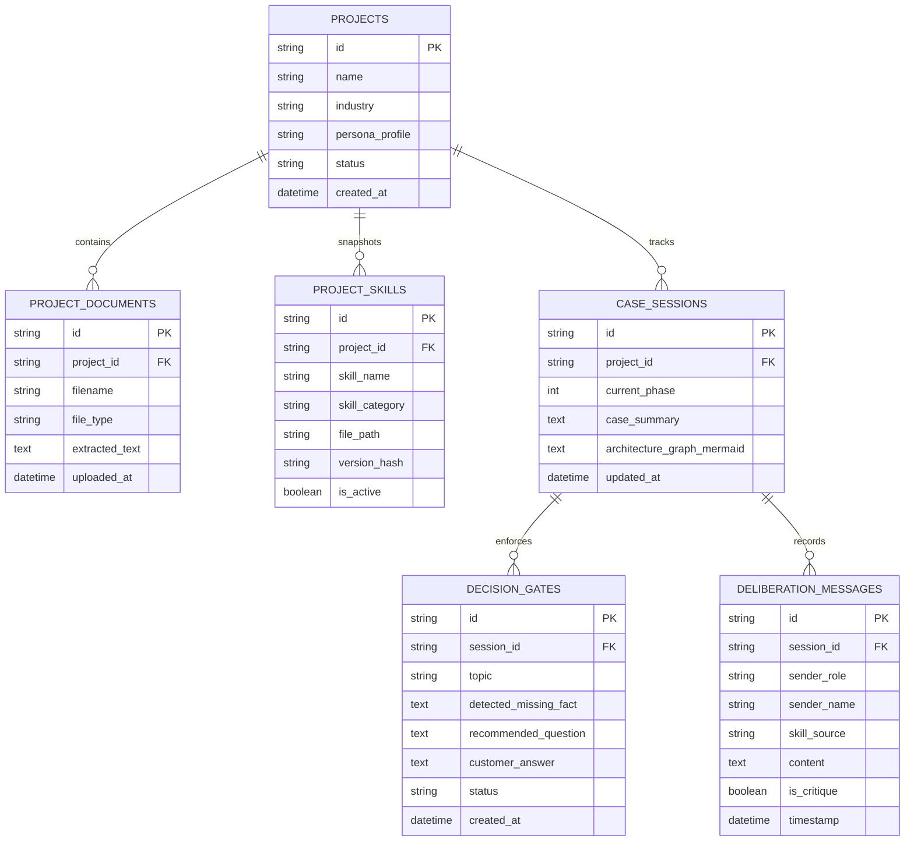
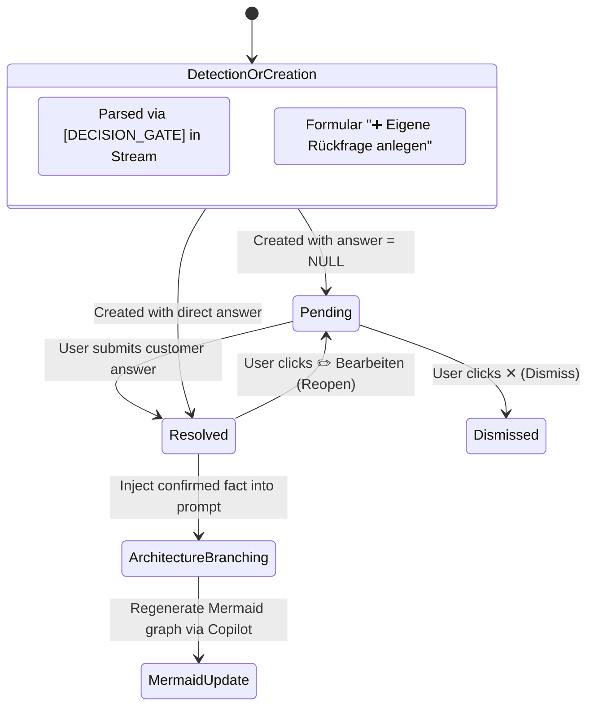
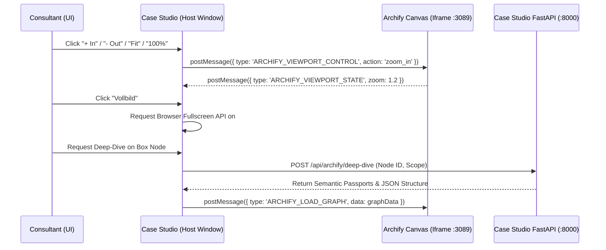
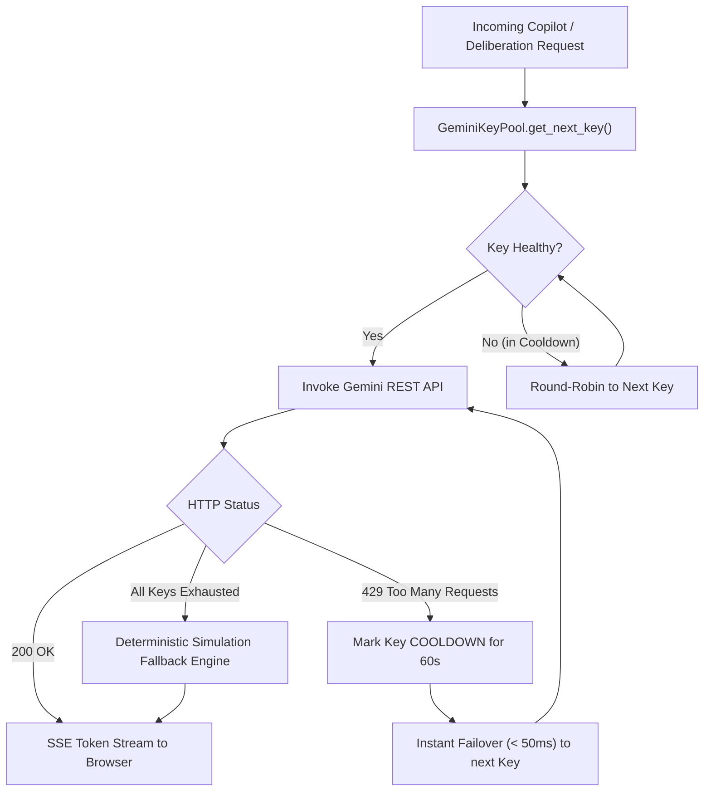

# 🏛️ Case Studio Suite – Technical Architecture & Protocol Specification
**File:** `ARCHITECTURE.md`  
**Repository:** [WizardofTryout/case-studio-suite](https://github.com/WizardofTryout/case-studio-suite)  
**Host Path:** `/Volumes/Spacestation/MCP/Antigravity-MCP-tools/Case-Studio`  
**Container:** `case-studio-suite` (Port `3088`), `archify-sidecar` (Port `3089`), `gitnexus-server` (Port `4747`), `gitnexus-web` (Port `4173`)  
**Status:** Validated, Production-Ready, GitNexus-Indexed  

---

## 📑 Table of Contents
1. [Core Architectural Principles](#1-core-architectural-principles)
2. [Multi-Container Deployment Topology](#2-multi-container-deployment-topology)
3. [Data Persistence Architecture (SQLite WAL & Snapshots)](#3-data-persistence-architecture-sqlite-wal--snapshots)
4. [Master-Consultant & Decision Gate State Machine](#4-master-consultant--decision-gate-state-machine)
5. [Archify Sidecar & Bi-Directional PostMessage Protocol](#5-archify-sidecar--bi-directional-postmessage-protocol)
6. [Gemini Multi-Key Pool & SSE Streaming Engine](#6-gemini-multi-key-pool--sse-streaming-engine)
7. [Multi-Agent Deliberation Coordinator](#7-multi-agent-deliberation-coordinator)
8. [GitNexus Code Intelligence & Knowledge Graph](#8-gitnexus-code-intelligence--knowledge-graph)

---

## 1. Core Architectural Principles

- **Zero Host Pollution:** All builds, runtimes, dependencies, and servers execute strictly inside Docker containers.
- **Local-First Data Sovereignty:** No cloud database lock-ins (Postgres/Redis/Mongo). All state resides in embedded SQLite WAL files and project directories mounted at `./data`.
- **Zero Speculative Drift:** When technical constraints are unknown, the system halts speculative branching and creates concrete *Decision Gates*.
- **No Native Browser Popups:** Strict UI standard prohibiting `alert()`, `confirm()`, and `prompt()`. All interactions use high-end Glassmorphism modals (`ConfirmModal`) and non-blocking toasts.
- **Resilient AI Pipeline:** Multi-key round-robin pool with 60s cooldowns on HTTP 429 and sub-50ms instant failover, with local deterministic simulation fallbacks.

---

## 2. Multi-Container Deployment Topology



---

## 3. Data Persistence Architecture (SQLite WAL & Snapshots)

### 3.1 SQLite WAL Configuration
The SQLite database (`/app/data/case_studio.db`) is initialized with:
```sql
PRAGMA journal_mode = WAL;
PRAGMA synchronous = NORMAL;
PRAGMA foreign_keys = ON;
PRAGMA busy_timeout = 5000;
```
This guarantees non-blocking concurrent reads during active SSE token streaming and parallel background jobs.

### 3.2 Relational Entity Relationship Diagram



### 3.3 Physical Directory Hierarchy
```
data/
├── case_studio.db             # Primary SQLite database file
├── case_studio.db-wal         # Write-Ahead Log journal
├── case_studio.db-shm         # Shared memory index
└── projects/
    └── {project_id}/
        ├── documents/         # Raw uploaded customer documents (PDF, MD, TXT)
        │   └── anforderungen.pdf
        └── skills/            # Immutable, SHA256-verified skill snapshots
            ├── ot_edge_architecture.md
            └── hallucination_critic.md
```

---

## 4. Master-Consultant & Decision Gate State Machine



### Lifecycle Details:
1. **Creation:** AI detects missing facts or consultant manually inputs them via `App.submitCustomDecisionGate()`.
2. **Persistence:** Saved into SQLite table `decision_gates` with `status: 'pending'` or `'resolved'`.
3. **Branching:** If resolved, triggers `App.runCopilotWithPrompt()` with:
   `Kundenfakt geklärt zu Thema '<topic>': Der Kunde hat bestätigt: '<answer>'. Bitte schärfe die Architektur basierend auf diesem harten Fakt nach und aktualisiere den Mermaid-Graphen!`
4. **Reopening:** `POST /api/decision_gates/{gate_id}/reopen` resets status to `pending`, clears answer, and focuses UI input for editing.

---

## 5. Archify Sidecar & Bi-Directional PostMessage Protocol

The interactive Archify visualizer runs as an isolated Nginx sidecar container on port `3089`. Communication with the Case Studio frontend occurs via secure `window.postMessage`.



### Semantic Passports Data Contract
Each node generated by `app/services/archify_service.py` contains:
```json
{
  "id": "node_edge_controller",
  "label": "SIMATIC IPC 227G Edge Controller",
  "semantic_passport": {
    "layer": "Schicht 1: OT & Edge Ingest",
    "throughput_kpi": "10.000 msgs/s",
    "latency_guarantee": "< 20ms",
    "protocols": ["OPC UA PubSub", "Profinet"],
    "security_level": "IEC 62443 SL2 / mTLS",
    "failover_mode": "48h Local Ring-Buffer (NVMe)",
    "status": "Production-Ready"
  }
}
```

---

## 6. Gemini Multi-Key Pool & SSE Streaming Engine



---

## 7. Multi-Agent Deliberation Coordinator

The Deliberation Coordinator (`app/core/deliberation.py`) orchestrates three specialized agents:
1. **Hallucination Critic (Red Team):** Rigorously scrutinizes edge-case physics, bandwidth constraints, hardware bottlenecks, and unverified assumptions.
2. **OT & Cloud Domain Specialist:** Formulates realistic industrial compromises (OPC UA, edge filtering, buffer sizing).
3. **Master-Consultant Lead:** Synthesizes the debate into an executive decision, outputs standard `[DECISION_GATE]` blocks, and generates the updated Mermaid diagram.

---

## 8. GitNexus Code Intelligence & Knowledge Graph

The entire Case Studio codebase is indexed into the **GitNexus** local graph engine:

### Knowledge Graph Statistics:
- **Indexed Symbols:** 1,621
- **Relationships / Edges:** 3,181
- **Community Clusters:** 44
- **Execution Flows / Processes:** 121

### Access & Commands:
- **Web UI:** [http://localhost:4173](http://localhost:4173)
- **MCP Server:** Runs on port `4747` (Streamable HTTP / SSE)
- **Impact Analysis (Blast Radius):**
  ```bash
  docker exec -it gitnexus-server gitnexus impact --repo Case-Studio <SymbolName>
  ```
- **Context 360° Inspection:**
  ```bash
  docker exec -it gitnexus-server gitnexus context --repo Case-Studio <SymbolName>
  ```
- **Re-indexing:**
  ```bash
  docker exec -it gitnexus-server gitnexus analyze /workspace/Case-Studio
  ```

---
*Created for Matthias Köhler (M.Sc.) | Case Studio Suite 2026*
