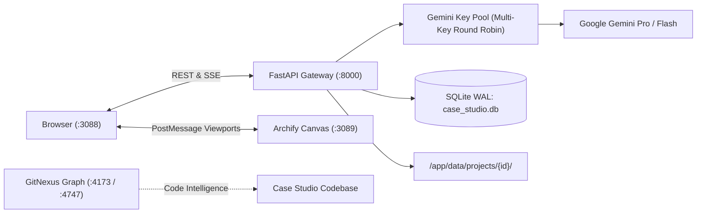

# 🏛️ Case Studio Suite

[](https://www.docker.com/)
[](https://fastapi.tiangolo.com/)
[](https://www.sqlite.org/wal.html)
[](https://deepmind.google/technologies/gemini/)
[](http://localhost:3089)
[](http://localhost:4173)

> **Enterprise-grade Standalone Platform for Real-Time Case Studies, Architecture Reviews, Decision Gates & Multi-Agent Deliberation.**

Developed for high-stakes enterprise technical case studies, C-level evaluations (e.g., Siemens Advanta Senior Technical Fit), and complex industrial AI / IoT workshops.

---

## 🌟 Executive Overview

In technical consulting and client workshops, requirements are almost never complete. Standard LLMs and junior consultants routinely fall into the **"assumption trap"**—hallucinating missing parameters and designing architectures that fail against real customer constraints.

**Case Studio Suite** solves this through:
1. **Master-Consultant Decision Gates:** Proactively identifies missing facts (cycle times, fieldbus protocols, latency, regulatory classes) and halts speculative branching. Provides formulated client questions and branches architecture in real time once answered.
2. **Custom Client Inquiry Management:** Consultants can manually create, track, edit, and reopen custom decision gates with full parity to AI-detected gates.
3. **Dual Visualizer (Mermaid Flow & Archify Canvas):** Instant schematic flowcharts via Mermaid.js plus deep interactive architectural exploration via containerized **Archify Sidecar** with Gemini **Semantic Passports** (latency, throughput, protocol tags, status badges).
4. **Synchronized Viewport & Fullscreen:** Unified toolbar controls (`+ In`, `- Out`, `Fit`, `100%`, `Vollbild`) controlling both the SVG diagram and Archify's canvas via bidirectional PostMessage.
5. **Multi-Agent Deliberation Studio:** Four-eyes review between a **Hallucination Critic**, an **OT & Cloud Specialist**, and the **Master-Consultant Lead**.
6. **Local-First Data Sovereignty:** 100% Docker-contained on Port `3088` with embedded **SQLite WAL** (`case_studio.db`) and immutable physical skill snapshots.
7. **GitNexus Code Intelligence:** Full knowledge graph indexing (1,621 symbols, 3,181 edges, 121 execution flows) on Ports `4173` / `4747` for instant impact analysis, blast-radius queries, and visual graph navigation.

---

## 🏗️ System Architecture & Port Map

```
┌──────────────────────────────────────────────────────────────────────────────────┐
│                           DOCKER CONTAINER TOPOLOGY                              │
├─────────────────────┬──────────────┬─────────────────────────────────────────────┤
│ Service             │ Port         │ Description                                 │
├─────────────────────┼──────────────┼─────────────────────────────────────────────┤
│ case-studio-suite   │ 3088 : 8000  │ FastAPI Backend + Glassmorphism UI (SPA)    │
│ archify-sidecar     │ 3089 : 80    │ Archify Interactive Canvas Engine (Nginx)   │
│ gitnexus-web        │ 4173 : 4173  │ GitNexus Visual Knowledge Graph UI          │
│ gitnexus-server     │ 4747 : 4747  │ GitNexus Code Intelligence & MCP Backend    │
└─────────────────────┴──────────────┴─────────────────────────────────────────────┘
```



---

## 🚀 Quickstart & Docker Commands

### 1. Prerequisites
- Docker & Docker Compose
- Google Gemini API Keys (optional; local simulation fallback is built-in)

### 2. Launch Case Studio Suite (with Archify Sidecar)
```bash
cd /Volumes/Spacestation/MCP/Antigravity-MCP-tools/Case-Studio

# Build and start container suite
docker compose --profile archify up -d --build case-studio-suite
```
Open **[http://localhost:3088](http://localhost:3088)** in your browser.

### 3. Launch GitNexus Code Intelligence
```bash
cd /Volumes/Spacestation/MCP/Antigravity-MCP-tools/gitnexus

# Start GitNexus web & server
docker compose up -d

# Re-index Case Studio codebase
docker exec gitnexus-server gitnexus analyze /workspace/Case-Studio
```
Open **[http://localhost:4173](http://localhost:4173)** in your browser to explore the knowledge graph.

---

## 📂 Project Structure

```
Case-Studio/
├── app/
│   ├── api/                 # FastAPI Endpoints (health, copilot, decision_gates, archify, etc.)
│   ├── core/                # Key pool, decision gate parser, deliberation engine, prompts
│   ├── db/                  # SQLite WAL database & repositories
│   ├── services/            # Copilot, Archify semantic passports, DMS, skills
│   └── static/              # Reactive Glassmorphism UI (HTML, CSS tokens, Vanilla JS)
├── data/                    # Persistent storage (case_studio.db, projects, skills snapshots)
├── skills_catalog/          # Curated enterprise domain skills (OT Edge, Snowflake, Critic, etc.)
├── features-add-ons/        # Archify Sidecar specifications & sprint documentation
├── Dockerfile               # Production multi-stage Dockerfile (Python 3.11-slim)
├── docker-compose.yml       # Container composition & volume mappings
├── how-to-case-studio.md    # Comprehensive 360-degree user and architecture manual
├── ARCHITECTURE.md          # Technical architecture & protocol specification
└── README.md                # Executive overview & quickstart
```

---

## 🛡️ Key Features In-Depth

### 1. Decision Gates & Real-Time Branching
- **AI-Detected Gates:** Automatically extracted from LLM streaming responses when missing facts are identified.
- **Consultant-Authored Inquiries:** Fast entry modal (`➕ Eigene Rückfrage anlegen`) for on-the-fly client questions.
- **Copy-to-Clipboard:** One-click copy of formulated questions for live video calls or emails.
- **Automatic Architecture Branching:** Once answered, the customer answer is permanently anchored as a hard fact and triggers real-time graph re-generation.
- **Reopen & Edit:** Easily reopen resolved gates with `✏️ Bearbeiten` if the client updates their requirements.

### 2. Archify Sidecar & Semantic Passports
- **Sidecar Isolation:** Runs in a separate container without bloating the main backend.
- **Bi-Directional PostMessage Bridge:** Seamless communication between host window and canvas iframe.
- **Semantic Passports:** Nodes feature structured technical attributes:
  - Throughput & Latency KPIs
  - Security & Compliance Badges (IEC 62443, TLS 1.3)
  - Protocol Badges (OPC UA, MQTT Sparkplug B, Kafka)
- **Unified Viewport Toolbar:** Zoom In/Out, Fit, 100%, and true Fullscreen.

### 3. Gemini Multi-Key Round-Robin & Simulation Fallback
- Dynamic pool across multiple Gemini API keys (`GEMINI_API_KEYS=key1,key2,...`).
- 60-second cooldown on HTTP 429 errors with sub-50ms instant failover.
- Embedded deterministic simulation fallback for offline demonstrations.

### 4. GitNexus Knowledge Graph Integration
- Indexed repository: **1,621 symbols**, **3,181 edges**, **44 clusters**, **121 flows**.
- Run blast-radius impact analysis before making code changes:
  ```bash
  docker exec -it gitnexus-server gitnexus impact --repo Case-Studio <SymbolName>
  ```
- Visual graph inspection at **`http://localhost:4173`**.

---

## 📄 Documentation
For detailed step-by-step guides, sprint history, and configuration details, refer to:
- 📖 [how-to-case-studio.md](how-to-case-studio.md) — Comprehensive user manual & operations guide
- 🏛️ [ARCHITECTURE.md](ARCHITECTURE.md) — Technical architecture & protocol specifications

---
*Created for Matthias Köhler (M.Sc.) | Case Studio Suite 2026*
