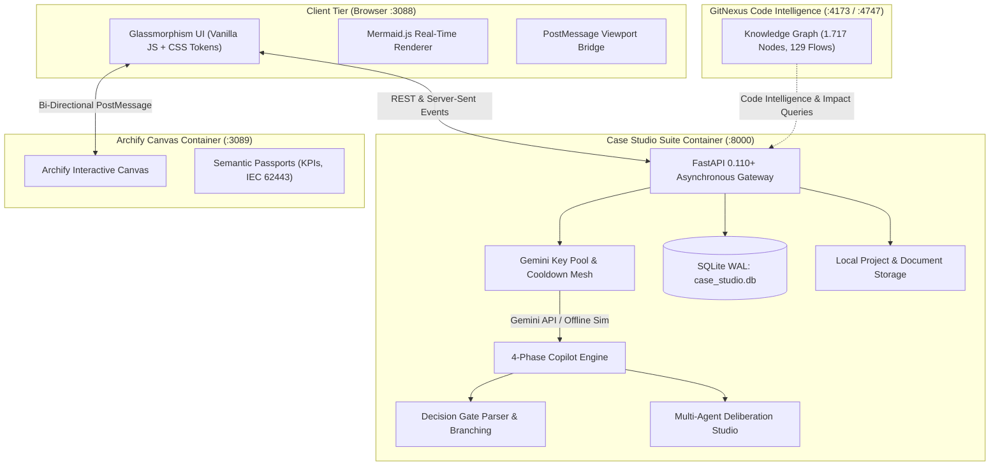

# 🏛️ Case Studio Suite

[](https://opensource.org/licenses/MIT)
[](https://www.docker.com/)
[](https://fastapi.tiangolo.com/)
[](https://www.python.org/)
[](https://www.sqlite.org/wal.html)
[](https://deepmind.google/technologies/gemini/)
[](http://localhost:3089)
[](http://localhost:4173)
[](https://github.com/WizardofTryout/case-studio-suite/pulls)

> **Enterprise Standalone Platform for Real-Time Technical Case Studies, Architecture Reviews, Decision Gates & Multi-Agent Deliberation.**

Designed for high-stakes enterprise technical case studies, C-level architecture pitches, and complex industrial IoT/AI workshops. Bridges the critical gap between executive consulting strategy and rigorous engineering constraints.

---

## 🌟 Why Case Studio Suite?

In real-world client workshops and architecture evaluations, requirements are **almost never complete**. Standard generative AI chat tools routinely fall into the **"assumption trap"**—unnoticeably guessing missing cycle times, fieldbus protocols, latency boundaries, or buffer capacities, which produces brittle architectures that fail in production.

**Case Studio Suite changes the paradigm:**

1. **Master-Consultant Decision Gates:** When critical facts are missing, the AI halts speculative drifting. It isolates the ambiguity and generates an executive **Decision Gate**—a targeted question to present to the client. Once answered, the fact is permanently locked in, dynamically re-branching the architecture.
2. **First-Class Custom Client Inquiries:** Consultants can record in-situ questions raised during live client workshops via a single click (`➕ Eigene Rückfrage anlegen`). Custom inquiries enjoy full parity with AI-detected gates.
3. **Dual Visualizer Engine:**
   - **Mermaid Flow:** Instant schematic topology rendered in real time.
   - **Archify Sidecar Canvas (Port 3089):** Interactive zoomable canvas with **Semantic Passports** for every node (throughput, latencies, protocols like OPC UA / MQTT Sparkplug B, IEC 62443 security levels).
4. **Multi-Agent Deliberation Studio:** A 4-eyes architecture review board featuring an incorruptible **Hallucination Critic** (red), a **Domain Specialist** (cyan), and the **Master-Consultant Lead** (purple) to stress-test hypotheses before finalizing designs.
5. **Interactive FAQ & Knowledge Center (`❓ FAQ & Hilfe`):** Curated guidance with live instant search, category filtering, and deep-link navigation with smooth-scroll and highlight pulses.
6. **"About Case Studio" Platform (`🏛️ Über Case Studio`):** Elegant executive-level breakdown of the 3 architectural pillars, technology radar, and compliance metrics.
7. **100% Local-First Data Sovereignty:** Embedded **SQLite WAL** (`case_studio.db`), physical skill snapshotting with SHA-256 integrity, zero external database requirements, and no cloud lock-in.
8. **Resilient Key Mesh & Offline Simulation:** Built-in **GeminiKeyPool** with sub-50ms failover across multiple keys, automated 60s cooldowns on HTTP 429 rate limits, and an embedded deterministic **simulation engine** for fully functional offline demonstrations.
9. **GitNexus Code Intelligence:** Live knowledge graph mapping 1,700+ symbols, 3,300+ relationships, and 129 execution flows on Ports `4173` / `4747`.

---

## 🏗️ System Architecture & Port Topology

```
┌────────────────────────────────────────────────────────────────────────────────────────┐
│                               DOCKER CONTAINER TOPOLOGY                                │
├─────────────────────┬──────────────┬───────────────────────────────────────────────────┤
│ Service             │ Port         │ Description                                       │
├─────────────────────┼──────────────┼───────────────────────────────────────────────────┤
│ case-studio-suite   │ 3088 : 8000  │ FastAPI REST/SSE Gateway + Glassmorphism UI (SPA) │
│ archify-sidecar     │ 3089 : 80    │ Archify Interactive Canvas Engine (Nginx Sidecar) │
│ gitnexus-web        │ 4173 : 4173  │ GitNexus Visual Knowledge Graph UI                │
│ gitnexus-server     │ 4747 : 4747  │ GitNexus MCP Server & Code Intelligence Engine    │
└─────────────────────┴──────────────┴───────────────────────────────────────────────────┘
```



---

## ⚡ Quickstart (Ready in 60 Seconds)

### 1. Prerequisites
- [Docker](https://docs.docker.com/get-docker/) & [Docker Compose](https://docs.docker.com/compose/)
- Google Gemini API Key(s) *(Optional: Case Studio runs completely self-contained with offline simulation if no keys are provided)*

### 2. Clone Repository
```bash
git clone https://github.com/WizardofTryout/case-studio-suite.git
cd case-studio-suite
```

### 3. Environment Setup (Optional)
```bash
cp .env.example .env
# Edit .env and enter your Gemini API keys if desired:
# GEMINI_API_KEYS=AIzaSy...,AIzaSy...
```

### 4. Launch Container Suite
```bash
# Build and start Case Studio Suite with Archify Sidecar
docker compose --profile archify up -d --build case-studio-suite
```

Open **[http://localhost:3088](http://localhost:3088)** in your browser!

---

## 🎯 The 4-Phase Consulting Framework

Case Studio structures complex technical problem-solving into 4 consulting-grade phases:

```
┌─────────────────┐   ┌─────────────────┐   ┌─────────────────┐   ┌─────────────────┐
│  1. CLARIFY     │ ➔ │  2. ARCHITECT   │ ➔ │  3. DEEP DIVE   │ ➔ │ 4. VALUE/ROADMAP│
│ Scoping & Gaps  │   │ 4-Layer Plan    │   │ Limits & Buffer │   │ ROI & Rollout   │
└─────────────────┘   └─────────────────┘   └─────────────────┘   └─────────────────┘
```

1. **Phase 1: Clarify & Scoping**  
   Isolates problem statements, identifies missing prerequisites, and surfaces initial client ambiguities before making assumptions.
2. **Phase 2: Architect & Blueprint**  
   Synthesizes the 4-layer enterprise blueprint (*OT Ingest ➔ Industrial Edge ➔ Streaming/Buffer ➔ Lakehouse/Cloud*) and generates live interactive graphs.
3. **Phase 3: Deep Dive & Trade-offs**  
   Stress-tests edge conditions: validates 48h offline buffering, latency thresholds (<20ms), and IEC 62443 security zones.
4. **Phase 4: Business Value & Executive Roadmap**  
   Quantifies business impact (OEE uplift, scrap rate reduction, payback in months) and structures a realistic 3-phase rollout roadmap (*PoC ➔ Pilot ➔ Scale*).

---

## 💡 Key Features Breakdown

### 🚪 1. Decision Gates & Live Branching
- **Automatic Gap Detection:** Detects when a customer briefing lacks crucial parameters and creates actionable decision gates.
- **Custom Client Inquiries:** Record questions that arise spontaneously in meetings with `➕ Eigene Rückfrage anlegen`.
- **Single-Click Copy:** Fast clipboard copying for video call chats or emails.
- **Fact Anchoring:** Submitting client answers locks them into the knowledge base as immutable facts, immediately re-triggering blueprint generation.
- **Reopen & Refine:** Existing gates can be reopened anytime with `✏️ Bearbeiten` when client requirements change.

### 📐 2. Dual Visualizer & Archify Semantic Passports
- **Mermaid Flow:** Lightning-fast, lightweight flowcharts for rapid streaming overviews.
- **Archify Sidecar (Port 3089):** Rich architectural canvas with node expansion.
- **Semantic Passports:** Every architectural node contains verified operational parameters:
  - Throughput (e.g., `50,000 msgs/s`)
  - Latency guarantees (`< 20ms`)
  - Protocols (`OPC UA`, `MQTT Sparkplug B`, `Kafka`)
  - Security certifications (`IEC 62443 SL2`, `mTLS`)
- **Synchronized Viewport Toolbar:** Zoom In, Zoom Out, Fit, 100%, and Fullscreen controls seamlessly synchronize across both engines.

### ⚔️ 3. Multi-Agent Deliberation Studio
- **Hallucination Critic (Red):** Tears down unverified assumptions, calculates hidden egress costs, and points out physics limits.
- **Domain Specialist (Cyan):** Supplies battle-tested OT, cloud, and streaming patterns.
- **Master-Consultant Lead (Purple):** Moderates debate, builds consensus, and produces the finalized architecture proposal.

### ❓ 4. In-Situ Help & Interactive FAQ Center
- **Contextual Info Badges (`ℹ️`):** Placed at all 8+ core UI components (telemetry, DMS, skills, stepper, triggers, gates, visualizer, deliberation).
- **Glassmorphism Quick-Modal:** Concise summary with single-click deep-link to the full FAQ.
- **Live-Search FAQ:** Real-time keyword filter across all questions, answers, and tags.
- **Smooth Deep-Linking:** Switches tabs, filters categories, opens accordion cards, and triggers an attention-grabbing glow animation on the target card.

### 🏛️ 5. "Über Case Studio" (About Platform)
- High-end corporate storytelling layout designed for C-level executives, recruiters, and engineering leads.
- Interactive cards explaining the 3 Core Pillars.
- Technology Radar with live performance metrics.
- Data Sovereignty & Compliance checklist.

---

## 🛡️ Data Sovereignty, Security & Local-First

- **Zero Cloud Database Dependencies:** Everything runs in embedded SQLite WAL mode under `./data/case_studio.db`.
- **Physical Skill Snapshotting:** Skills imported into a project are physically cloned into the project directory and hashed via SHA-256 for audit immutability.
- **Zero Native Popups:** Strictly adheres to the modern web design guideline—zero `window.alert`, `window.confirm`, or `window.prompt`. All dialogs are responsive glassmorphism overlays.
- **GDPR / Privacy Compliant:** No third-party tracking, no external telemetry analytics, no cloud data harvesting.

---

## 🕸️ GitNexus Code Intelligence

Case Studio Suite is fully indexed by [GitNexus](https://github.com/WizardofTryout/case-studio-suite):
- **1,717 nodes | 3,316 edges | 44 clusters | 129 flows**
- Inspect call chains, symbol relationships, and blast radii:
  ```bash
  # Start GitNexus containers
  docker compose -f ../gitnexus/docker-compose.yaml up -d

  # Re-index repository
  docker exec gitnexus-server gitnexus analyze /workspace/Case-Studio
  ```
- Explore the interactive visual knowledge graph at **[http://localhost:4173](http://localhost:4173)**.

---

## 📁 Repository Structure

```
case-studio-suite/
├── app/
│   ├── api/                 # FastAPI routes (health, copilot, gates, skills, archify, dms)
│   ├── core/                # GeminiKeyPool, decision gate parsers, deliberation prompts
│   ├── db/                  # SQLite WAL connection manager and repositories
│   ├── services/            # Copilot engine, Archify semantic passports, skill scanner
│   └── static/              # Reactive Glassmorphism UI (HTML, CSS tokens, Vanilla JS)
│       ├── css/style.css    # Responsive design system (dark/light themes, animations)
│       ├── js/app.js        # SPA application controller
│       ├── js/help_content.js # Bilingual FAQ & contextual help knowledge base
│       └── js/i18n.js       # Internationalization dictionary (German & English)
├── data/                    # Local persistent volume (case_studio.db, projects, skills)
├── skills_catalog/          # Curated domain knowledge packs (OT Edge, Snowflake, Critic)
├── services/archify-sidecar # Archify interactive canvas sidecar container
├── Dockerfile               # Multi-stage production container build (Python 3.11-slim)
├── docker-compose.yml       # Production Compose file with profiles & healthchecks
├── LICENSE                  # MIT License
└── README.md                # This document
```

---

## 🤝 Contributing

Contributions, feedback, and feature requests are welcome!
1. Fork the Project
2. Create your Feature Branch (`git checkout -b feature/AmazingFeature`)
3. Commit your Changes (`git commit -m 'feat: Add AmazingFeature'`)
4. Push to the Branch (`git push origin feature/AmazingFeature`)
5. Open a Pull Request

---

## 📄 License

Distributed under the **MIT License**. See [`LICENSE`](LICENSE) for more information.

---

## 👤 Author & Architecture Lead

**Matthias Köhler (M.Sc.)**  
*Senior Strategic Project Manager & Industrial AI Architect*  
- GitHub: [@WizardofTryout](https://github.com/WizardofTryout)  
- Website: [oszillation-media.com](https://oszillation-media.com)  

*Case Studio Suite 2026 – Engineered for Sovereign Enterprise Consulting.*
