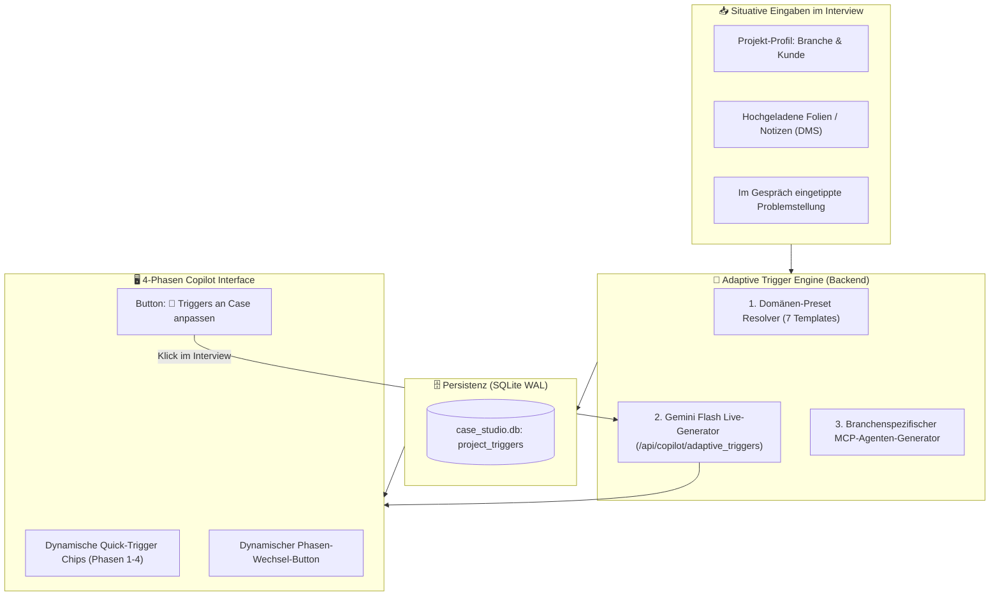

# 🎯 Case Studio Suite – Adaptive Case Trigger Engine: Dynamische Fallstudien-Intelligenz ohne Hardcoding
**Datei:** `adaptive-case-triggers-plan.md`  
**Projekt:** Case Studio Suite (Standalone Docker auf Port `3088`)  
**Status:** Strategischer Architekturplan / Höchste Priorität für Live-Interviews  
**Ziel:** Vollständige Eliminierung statischer Inhalte – 100 % adaptive, KI-gestützte Situations-Trigger für jede denkbare Fallstudie (Industrie, Energie, Cloud, Logistik, MedTech, Smart City, etc.)

---

## 📑 Inhaltsverzeichnis
1. [Problemstellung & Notwendigkeit für das morgige Gespräch](#1-problemstellung--notwendigkeit-für-das-morgige-gespräch)
2. [Architektur der Adaptive Trigger Engine](#2-architektur-der-adaptive-trigger-engine)
3. [Die 7 Enterprise-Domänen-Presets (Sofort-Start)](#3-die-7-enterprise-domänen-presets-sofort-start)
4. [Live Case-Adaptation (KI-Generierung in Echtzeit)](#4-live-case-adaptation-ki-generierung-in-echtzeit)
5. [Das universelle MCP-Muster (Model Context Protocol für jede Branche)](#5-das-universelle-mcp-muster-model-context-protocol-für-jede-branche)
6. [Dynamische Phasen-Übergänge (Context-Aware Transitions)](#6-dynamische-phasen-übergänge-context-aware-transitions)
7. [Datenmodell & API-Spezifikation (SQLite WAL)](#7-datenmodell--api-spezifikation-sqlite-wal)
8. [UI/UX Wireframe: Situative Trigger-Bar](#8-uiux-wireframe-situative-trigger-bar)
9. [Copy-Paste Prompt für den AI-Developer-Agenten](#9-copy-paste-prompt-für-den-ai-developer-agenten)
10. [Human-in-the-Loop Test-Checkliste für den Live-Einsatz](#10-human-in-the-loop-test-checkliste-für-den-live-einsatz)

---

## 1. Problemstellung & Notwendigkeit für das morgige Gespräch

### 🔍 Das akute Risiko statischer Inhalte
In der bisherigen Fassung (Sprint 1–4) sind die Quick-Triggers in `app/static/js/app.js` noch statisch auf ein einzelnes Szenario verdrahtet:
* *„OPEX vs. Qualität bei Werkzeugbruch“*
* *„SIMATIC SPS über PROFINET an Industrial Edge“*
* *„Kafka 10.000 Telemetrie-Events/s & Snowflake Lakehouse“*
* *„Anomalieerkennung & Wartungsdisposition Frässpindeln“*

### ⚠️ Was passiert, wenn morgen eine völlig andere Fallstudie präsentiert wird?
Wird im Interview plötzlich ein Case aus einem anderen Bereich gestellt:
* **Smart Grid / Energie:** z. B. Lastspitzen-Glättung bei 50.000 vernetzten PV-Speichern und Umspannwerken.
* **Airport- & Logistik-Hub:** z. B. Gepäckförderanlagen-Optimierung und fahrerlose Transportsysteme (AGV).
* **MedTech / Healthcare:** z. B. Cloud-Anbindung vernetzter Dialyse-Geräte unter MDR- und HIPAA-Compliance.
* **Enterprise Cloud & IT-Transformation:** z. B. Mainframe-Modernisierung und SAP S/4HANA Migration.

**Folge:** Die fest einprogrammierten Frässpindel-Buttons passen nicht mehr zum Kontext und wirken deplatziert.

### 💡 Die Lösung: Voll-Adaptive KI-Trigger
1. **Null Hardcoding:** Keine festen Industrie-Texte mehr als zwingende Vorgabe.
2. **7 Domänen-Presets:** Sofortige branchenspezifische Trigger bei Neuanlage eines Projekts.
3. **Live-Case Inferenz (`🔄 Triggers an Case anpassen`):** Sobald die Problemstellung des Interviewers eingetippt oder das Lastenheft-PDF ins DMS hochgeladen wird, generiert Gemini in < 1,5 Sekunden vier **perfekt auf genau diesen Kundenfall zugeschnittene Quick-Triggers pro Phase**.
4. **Universelles MCP-Paradigma:** MCP bleibt als methodischer Kern erhalten, adaptiert sich aber automatisch an die Fachsysteme der jeweiligen Branche.

---

## 2. Architektur der Adaptive Trigger Engine



---

## 3. Die 7 Enterprise-Domänen-Presets (Sofort-Start)

Wählt man beim Anlegen eines Projekts eine Branche aus, werden sofort die passenden Vorlagen geladen:

| Domäne | Phase 1 (Clarify) Fokus | Phase 2 (Architect) Fokus | Phase 3 (Deep Dive) Fokus | Phase 4 (Value) Fokus |
|---|---|---|---|---|
| **1. Industrial OT & Smart Factory** | Latenz (<20ms), Hallennetz, Maschinensilos | SPS/OPC UA, Edge Ingest, Lakehouse, **MCP Instandhaltung** | 48h Offline-Puffer, IEC 62443, Not-Aus | OEE +3.4%, Ausschuss -65%, 9 Mon. Rollout |
| **2. Energy, Smart Grid & Utilities** | Smart Meter Rollout, Netzstabilität, EnWG | SCADA/IEC 61850, Kafka Time-Series, **MCP Lastfluss-Steuerung** | Blackout-Resilienz, BSI-Kritis-Sicherheit | Peak-Shaving ROI, Netzentgelt-Einsparung |
| **3. Logistics, Fleet & Supply Chain** | Sendungsverfolgung, Yard Management | Telematik Ingest, Graph-DB, **MCP ETA- & Dispositions-Agent** | Funklöcher (Offline-Tracking), Geofencing | Tourenoptimierung -14%, Flotten-TCO |
| **4. Cloud Enterprise & Modernization** | Legacy-Monolithen, Silos, Cloud-Readiness | Event-Driven Microservices, API Gateway, **MCP API-Agenten** | Zero-Trust, Multi-Region Failover, FinOps | Cloud-Migration TCO, Lizenzkosten -40% |
| **5. MedTech & Life Sciences** | MDR/FDA Regulierung, Patientendaten (PII) | FHIR/HL7 Ingest, Validiertes DWH, **MCP Diagnose-Assistenz** | Ende-zu-Ende Verschlüsselung, ISO 13485 | Klinische Durchlaufzeit -25%, Audit-Sicherheit |
| **6. Smart Infrastructure & Buildings** | Raumklima, Energieeffizienz, Brandschutz | BACnet / Modbus, IoT Hub, **MCP HVAC-Optimierung** | Sensor-Ausfall, Notstrom-Betrieb | ESG-Reporting, 22% Heizkosten-Reduktion |
| **7. Cross-Domain / Universell (Offen)** | Kern-Pain-Points, Stakeholder, Budget | End-to-End Datenfluss, Lakehouse, **MCP System-Agenten** | Skalierbarkeit, Sicherheit, Single Point of Failure | Business Case, 3-Phasen-Roadmap |

---

## 4. Live Case-Adaptation (KI-Generierung in Echtzeit)

Das stärkste Feature für das morgige Gespräch:

### Der Ablauf im Live-Interview:
1. Der Interviewer stellt die Aufgabe:  
   *„Nehmen wir an, ein europäischer Flughafenbetreiber hat Probleme mit Ausfällen der Gepäckförderanlagen an Terminal 2. Die Sensorik liefert Daten, aber das Leitsystem ist veraltet.“*
2. Du tippst diese 2 Sätze in Phase 1 ein (oder fügst sie als Notiz ins DMS ein) und klickst auf **`🔄 Triggers an Case anpassen`**.
3. **Innerhalb von 1,2 Sekunden** sendet das Backend eine strukturierte Anfrage an Gemini Flash:
   * System-Prompt: *„Analysiere den folgenden Case und generiere jeweils 4 hochgradig professionelle, situative Quick-Triggers für die Phasen 1 bis 4 inklusive eines domänenspezifischen MCP-Agenten-Triggers.“*
4. Die UI tauscht die Buttons unter dem Eingabefeld sofort aus:
   * **Phase 1:** `🎯 Ziel: Gepäckverlust vs. Durchsatz` · `⏱️ Gepäckumlaufzeit <12min` · `📊 Altsystem: Profibus-Silos` · `👥 Stakeholder: Bundespolizei & Airlines`
   * **Phase 2:** `⚙️ Förderband-Sensorik & SCADA Ingest` · `⚡ Event-Hub Telemetrie` · `❄️ Airport Operations Lakehouse` · **`🤖 MCP Gepäckrouting- & Wartungs-Agent`**
   * **Phase 3:** `🛡️ Ausfall Weiche 4: Redundante Bypässe` · `⚖️ Lokale Sortier-Logik vs. Cloud` · `🔒 Kritis & Luftsicherheits-Norm`
   * **Phase 4:** `📈 Verspätete Gepäckstücke -80%` · `🗓️ 3-Phasen-Rollout (Terminal 2 ➔ Hub)` · `👔 Workstream-Zuschnitt`

---

## 5. Das universelle MCP-Muster (Model Context Protocol für jede Branche)

Das **Model Context Protocol (MCP)** ist der entscheidende Hebel, um in technischen Interviews Senior-Kompetenz zu demonstrieren. Die Adaptive Engine formuliert den MCP-Trigger in Phase 2 **immer passend zur Domäne**:

| Branche | Generierter MCP-Trigger für Phase 2 |
|---|---|
| **Fertigung** | *„Integriere autonome KI-Agenten über MCP zur Kopplung von Schwingungs-Telemetrie mit dem SAP PM Instandhaltungssystem.“* |
| **Flughafen / Logistik** | *„Integriere autonome KI-Agenten über MCP zur dynamischen Gepäck-Umleitung bei Bandstillständen und automatisierten Techniker-Alarmierung.“* |
| **Energie / Grid** | *„Integriere autonome KI-Agenten über MCP zur vorausschauenden Einspeisesteuerung via SCADA und automatisierten Netzentlastungs-Schaltungen.“* |
| **MedTech** | *„Integriere autonome KI-Agenten über MCP zur regulatorisch konformen Auswertung von Telemetriedaten mit Freigabe-Gate für Klinikpersonal.“* |
| **Cloud Enterprise** | *„Integriere autonome KI-Agenten über MCP zur automatisierten Vorfall-Triage, Log-Analyse und Jira/ServiceNow Ticketerstellung.“* |

---

## 6. Dynamische Phasen-Übergänge (Context-Aware Transitions)

Auch die großen Aktions-Buttons am Ende jeder Phase (z. B. *„➔ Phase 1 abschließen & Blueprint generieren“*) dürfen nicht hartkodiert von Frässpindeln sprechen!

* **Dynamischer Prompt-Generator für Übergänge:**  
  Beim Klick auf den Phasen-Abschluss-Button fasst die Engine die **bereits geklärten Fakten und Decision Gates der vorherigen Phase** zusammen:
  > *„Basierend auf den geklärten Anforderungen für [KUNDEN_CASE] (Fakten: [FAKT_1], [FAKT_2]): Erstelle nun den vollständigen 4-Schichten Blueprint für Phase 2 mit Schicht 1 ([INGEST]), Schicht 2 ([STREAMING]), Schicht 3 ([LAKEHOUSE]) und Schicht 4 (MCP-Agenten-Orchestrierung für [SYSTEM_NAME]). Zeichne den Mermaid-Graphen.“*

---

## 7. Datenmodell & API-Spezifikation (SQLite WAL)

### SQLite Schema-Erweiterung:
```sql
-- DYNAMISCHE CASE-TRIGGER PRO PROJEKT & PHASE
CREATE TABLE IF NOT EXISTS project_adaptive_triggers (
    id TEXT PRIMARY KEY,
    project_id TEXT REFERENCES projects(id) ON DELETE CASCADE,
    phase INTEGER NOT NULL,          -- 1, 2, 3, 4
    trigger_index INTEGER NOT NULL,  -- 0, 1, 2, 3
    label TEXT NOT NULL,             -- z. B. '🤖 MCP Gepäckrouting-Agent'
    prompt TEXT NOT NULL,            -- Vollständiger Prompt-Text
    is_custom INTEGER DEFAULT 0,     -- 1 wenn manuell editiert
    created_at TIMESTAMP DEFAULT CURRENT_TIMESTAMP,
    UNIQUE(project_id, phase, trigger_index)
);
```

### Neue API-Endpunkte (`app/api/copilot.py`):
1. `GET /api/projects/{project_id}/triggers`  
   ➔ Liefert die aktuellen Trigger für alle 4 Phasen des Projekts.
2. `POST /api/projects/{project_id}/triggers/generate`  
   ➔ **Live-Adaptation:** Analysiert Projekttitel, Branche, Dokumente und Freitext; generiert 16 maßgeschneiderte Trigger (4 pro Phase) und speichert sie in SQLite.
3. `PUT /api/projects/{project_id}/triggers`  
   ➔ Erlaubt manuelles Anpassen einzelner Triggers.

---

## 8. UI/UX Wireframe: Situative Trigger-Bar

```
┌─────────────────────────────────────────────────────────────────────────────────────────────┐
│ EINGABE DER PROBLEMSTELLUNG / KUNDEN-ANFORDERUNG:                                           │
│ ┌─────────────────────────────────────────────────────────────────────────────────────────┐ │
│ │ Gepäckförderanlagen Terminal 2 fallen unvorhergesehen aus...                            │ │
│ └─────────────────────────────────────────────────────────────────────────────────────────┘ │
│                                                                                             │
│ Situative Quick-Triggers (Passend zum Flughafen-Case):          [🔄 Triggers an Case anpassen]│
│ ┌──────────────────────┐ ┌──────────────────────┐ ┌──────────────────────┐ ┌──────────────┐ │
│ │ ⚙️ Gepäckband-Sensorik│ │ ⚡ Telemetrie-Ingest │ │ ❄️ Airport Lakehouse │ │ 🤖 MCP-Agent │ │
│ └──────────────────────┘ └──────────────────────┘ └──────────────────────┘ └──────────────┘ │
│                                                                                             │
│ Round-Robin Gemini Pro Engine                                [ 🚀 Analysieren & Streamen ]  │
└─────────────────────────────────────────────────────────────────────────────────────────────┘
```

---

## 9. Copy-Paste Prompt für den AI-Developer-Agenten

Diesen Prompt kannst du direkt an den Developer-Agenten übergeben:

```text
Du bist als Senior Fullstack Engineer beauftragt, die Adaptive Case Trigger Engine für die Case Studio Suite umzusetzen.

ZIEL: 
Beseitige jegliches Hardcoding in den Quick-Triggers und Phasen-Übergängen, damit die Suite für JEDE beliebige Fallstudie (Industrie, Energie, Logistik, Cloud, MedTech, etc.) vollautomatisch maßgeschneiderte Trigger bereitstellt.

ARBEITSGRUNDLAGE:
Lies die Spezifikation in 
`/Volumes/Spacestation/MCP/Antigravity-MCP-tools/Case-Studio/adaptive-case-triggers-plan.md` 
sowie das Handbuch in 
`/Volumes/Spacestation/MCP/Antigravity-MCP-tools/Case-Studio/how-to-case-studio.md`.

AUFGABEN:
1. DATENMODELL & SERVICE (app/db/schema.py, repositories.py & app/services/trigger_service.py):
   - Erstelle die Tabelle 'project_adaptive_triggers' gemäß Kapitel 7.
   - Implementiere in 'trigger_service.py' die 7 Branchen-Presets (Industrial OT, Energy/Grid, Logistics, Cloud Enterprise, MedTech, Smart Buildings, Cross-Domain).
   - Implementiere 'generate_adaptive_triggers(project_id, case_text)': Sendet eine strukturierte Anfrage an 'key_pool.generate' mit Gemini Flash, um aus dem Case-Kontext 16 hochspezifische Trigger (4 pro Phase) inklusive domänenspezifischem MCP-Agenten-Trigger zu generieren.

2. API-ENDPUNKTE (app/api/copilot.py):
   - GET /api/projects/{project_id}/triggers -> Liefert die aktuellen Trigger des Projekts (falls noch keine existieren, initialisiere aus dem Preset der Projektbranche).
   - POST /api/projects/{project_id}/triggers/generate -> Triggert die Live-Adaption und gibt die neuen Triggers zurück.

3. DYNAMISCHES FRONTEND (app/static/js/app.js & app/static/index.html):
   - Ersetze das statische 'PHASE_TRIGGERS'-Objekt in 'app.js': Die Trigger werden künftig beim Projektwechsel dynamisch von der API geladen.
   - Füge neben dem Label 'Situative Quick-Triggers:' einen interaktiven Button ein:
     '<button id="btn-adapt-triggers" class="btn btn-secondary btn-xs">🔄 Triggers an Case anpassen</button>'.
   - Bei Klick auf den Button: Sende den aktuellen Text aus der Textarea oder die Fall-Notizen an '/api/projects/{id}/triggers/generate' und rendere die 4 Buttons der aktuellen Phase sofort neu.
   - Dynamisiere die Phasen-Übergangs-Prompts ('PHASE_TRANSITIONS'), sodass sie sich auf das Thema des aktuellen Projekts beziehen statt starr auf Frässpindeln.

🚨 STRIKTE ARBEITS- & TEST-REGELN (HUMAN-IN-THE-LOOP):
- Der Nutzer ist der finale Tester. Verschwende KEINE Tokens für lange simulierte Test-Skripte!
- Halte die Null-Native-Popups Regel strikt ein (kein alert(), kein confirm()).
- Baue den Container frisch: 'docker compose up -d --build case-studio-suite'.
- Committe alle Änderungen mit Conventional Commits ('feat(triggers): implement adaptive case trigger engine') und pushe auf 'main' und 'develop'.
- Melde dich nach Fertigstellung mit einer kurzen Test-Checkliste zur Abnahme im Browser (http://localhost:3088).
```

---

## 10. Human-in-the-Loop Test-Checkliste für den Live-Einsatz

| Test-Szenario | Handlung | Erwartetes Ergebnis |
|---|---|---|
| **Neues Projekt anlegen** | Projekt mit Branche *„Energy & Smart Grid“* erstellen | Sofort erscheinen Grid-spezifische Trigger (SCADA, Smart Meter, Lastfluss-MCP). |
| **Live Case Adaptation** | Text eingeben: *„Flughafen Gepäckband Terminal 2 fällt aus...“* und Klick auf `🔄 Triggers an Case anpassen` | Nach < 2 Sekunden wechseln alle Buttons auf Gepäckförderung, Durchlaufzeiten und Flughafen-MCP. |
| **Phasen-Wechsel** | Klick auf `Phase 2` | Die für Phase 2 generierten 4 Architektur-Trigger erscheinen sauber formatiert. |
| **Container-Persistenz** | Seite neu laden (`F5`) | Die generierten Trigger bleiben für das Projekt in SQLite gespeichert und sofort sichtbar. |

---
*Erstellt für die Case Studio Suite 2026*
