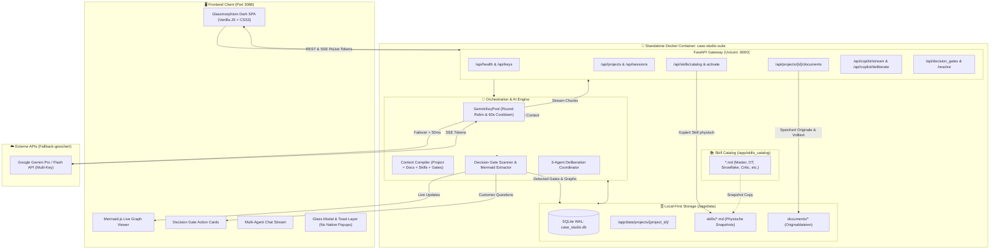

# 🏛️ Case Studio Suite – Umfassendes Handbuch & Architektur-Dokumentation
**Datei:** `how-to-case-studio.md`  
**Plattform:** Case Studio Suite (Standalone Docker auf Port `3088`)  
**Repository:** [WizardofTryout/case-studio-suite](https://github.com/WizardofTryout/case-studio-suite)  
**Status:** Produktionsbereit & Verifiziert  

---

## 📑 Inhaltsverzeichnis
1. [Einführung & Vision](#-1-einführung--vision)
2. [Entstehungsverlauf & Sprint-Chronik](#-2-entstehungsverlauf--sprint-chronik)
3. [Systemarchitektur & Das Zusammenspiel aller Komponenten](#-3-systemarchitektur--das-zusammenspiel-aller-komponenten)
4. [Datenhoheit & Persistenz (SQLite WAL & Physisches Snapshotting)](#-4-datenhoheit--persistenz-sqlite-wal--physisches-snapshotting)
5. [Die Master-Consultant- & Decision-Gate-Engine](#-5-die-master-consultant---decision-gate-engine)
6. [Gemini Multi-Key Round-Robin & SSE-Streaming](#-6-gemini-multi-key-round-robin--sse-streaming)
7. [Multi-Agenten Deliberation Studio](#-7-multi-agenten-deliberation-studio)
8. [Schritt-für-Schritt How-To (Praxisleitfaden)](#-8-schritt-für-schritt-how-to-praxisleitfaden)
9. [Betrieb, Konfiguration & Docker-Befehle](#-9-betrieb-konfiguration--docker-befehle)
10. [GitHub-Backup & Branch-Strategie](#-10-github-backup--branch-strategie)

---

## 🎯 1. Einführung & Vision

Die **Case Studio Suite** ist eine hochperformante, containerisierte Standalone-Plattform, die speziell für anspruchsvolle technische Fallstudien, C-Level-Evaluierungen (z. B. Siemens Advanta Senior Technical Fit), Architektur-Reviews und explorative Kunden-Workshops entwickelt wurde.

### Das Kernproblem traditioneller Beratung & KI-Tools
In realen Kundeninterviews und technischen Pitches liegen Anforderungen fast nie vollständig vor. Standardmäßige KI-Modelle oder unerfahrene Consultants tappen hier regelmäßig in die **„Annahmen-Falle“**: Fehlende Rahmenbedingungen werden stillschweigend erraten, spekulative Architekturen aufgebaut und am Ende an den tatsächlichen Kundenrestriktionen vorbeigeplant.

### Die Lösung der Case Studio Suite
1. **Souveräne Gesprächsführung statt blindem Raten:** Der integrierte **Master-Consultant** erkennt an kritischen Weggabelungen (z. B. Edge vs. Cloud, Zykluszeiten, Altsystem-Protokolle, Bandbreiten-Engpässe), wenn unverzichtbare Kundenfakten fehlen. Er stoppt die Spekulation und formuliert sofort eine **präzise, hochprofessionelle Rückfrage an das Gegenüber** (*Decision Gate*).
2. **Multi-Agenten Vier-Augen-Prinzip:** Ein konfigurierbares Team aus strategischem Lead, tiefem Domänenexperten und einem unbestechlichen **Hallucination Critic** debattiert Architekturentwürfe in Echtzeit, deckt versteckte Annahmen auf und liefert konkrete Autokorrekturen.
3. **100 % Datenhoheit & Portabilität:** Die gesamte Anwendung läuft isoliert im Docker-Container auf Port `3088` mit einer eingebetteten SQLite-Datenbank im **WAL-Modus** (`case_studio.db`) und physischen Markdown-Snapshots im Projektordner. Keine externen Cloud-Datenbanken (Postgres/Redis/Mongo), kein Lock-in.

---

## 📜 2. Entstehungsverlauf & Sprint-Chronik

Die Implementierung der Plattform erfolgte streng nach dem im [Masterplan](file:///Volumes/Spacestation/CV-2026-all/job-offers/siemens/Recruiter-Termin/2nd-round/CASE_STUDIO_APP_MASTERPLAN.md) definierten Phasenmodell. Hier ist der transparente Ablauf der Entstehung:

```
┌────────────────────────────────────────────────────────────────────────────────────────┐
│                        ENTSTEHUNGS-CHRONIK & MEILENSTEINE                              │
├───────────────────┬───────────────────┬───────────────────┬────────────────────────────┤
│ SPRINT 1          │ SPRINT 2          │ SPRINT 3          │ SPRINT 4                   │
│ Docker, FastAPI & │ Multi-Key Engine  │ DMS & Physisches  │ Master-Consultant,         │
│ SQLite WAL        │ & SSE Streaming   │ Skill-Snapshotting│ Deliberation & Live-Graph  │
└───────────────────┴───────────────────┴───────────────────┴────────────────────────────┘
```

### 🔹 Sprint 1: Container-Infrastruktur, FastAPI & SQLite WAL
* **Ziel:** Ein portables Docker-Setup ohne Host-Pollution mit strikter Isolation zu Fremdsystemen (insb. `Legal Studio`).
* **Ergebnis:**
  * Multi-Stage `Dockerfile` (Python 3.11-slim) mit minimalem Footprint und automatischem Healthcheck (`curl -f /api/health`).
  * `docker-compose.yml` mit Port-Mapping Host `3088` ➔ Container `8000` und persistentem Volume `./data:/app/data`.
  * `AGENTS.md` und `.agent/rules/AGENTS.md` mit strikten Sicherheits-, Isolations- und Backup-Vorschriften.
  * SQLite WAL-Initialisierung in `app/db/database.py` und relationales Schema gemäß Kapitel 4.2 (`projects`, `project_documents`, `project_skills`, `case_sessions`, `decision_gates`, `deliberation_messages`).

### 🔹 Sprint 2: Gemini Multi-Key Round-Robin & Streaming
* **Ziel:** Ausfallsichere KI-Anbindung ohne 429-Rate-Limit-Blockaden und mit geringer Latenz.
* **Ergebnis:**
  * `GeminiKeyPool` in `app/core/gemini_pool.py`: Verwaltung beliebig vieler Keys aus `.env` (`GEMINI_API_KEYS=key1,key2,...`).
  * Automatischer 60s-Cooldown bei HTTP 429 und Sofort-Failover auf den nächsten Key (< 50ms).
  * Integrierter Simulations-Fallback: Sollten keine API-Keys hinterlegt sein oder alle Keys im Cooldown sein, liefert das System dennoch realistische, kontextbezogene Architekturanalysen und Mermaid-Graphen.
  * SSE-Streaming via `POST /api/copilot/stream` mit Time-to-First-Token < 500ms.

### 🔹 Sprint 3: DMS mit PDF-Extraktion & Physisches Skill-Snapshotting
* **Ziel:** Dokumente indexieren und Fachagenten-Wissen dauerhaft reproduzierbar an das Projekt binden.
* **Ergebnis:**
  * Vollwertiges DMS in `app/services/dms_service.py` mit direkter Extraktion aus PDF (`pypdf`), Markdown und Plain Text.
  * Globaler Skill-Katalog in `/app/skills_catalog` mit 6 kuratierten Enterprise-Skills (*Master Consultant Lead*, *OT Edge Architecture*, *Snowflake Data Engineer*, *Hallucination Critic*, *Cloud IoT Streaming*, *Siemens Industrial AI*).
  * **Physisches Skill-Snapshotting:** Beim Aktivieren eines Skills wird die Datei physisch in `/app/data/projects/{id}/skills/` kopiert, per `SHA256` gehasht und in `project_skills` registriert. Dadurch bleibt jedes Projekt auch Jahre später identisch auditierbar.

### 🔹 Sprint 4: Master-Consultant Fact-Gates, Deliberation Studio & End-to-End Test
* **Ziel:** Vollständige Vernetzung im Glassmorphism-UI, Decision-Gate-Logik und Multi-Agenten-Debatte.
* **Ergebnis:**
  * Master-Consultant Scanner in `app/core/decision_gate.py`: Extrahiert `[DECISION_GATE]`-Blöcke und legt offene Rückfragen an den Kunden in der Datenbank ab.
  * 3-Agenten Deliberation Engine in `app/core/deliberation.py`: Ermöglicht strukturierte Diskussionen zwischen Kritiker, Fachexperte und Master-Consultant.
  * Live Mermaid.js-Graphen: Automatische Extraktion und Live-Visualisierung von Architekturdiagrammen.
  * Modernes Web-UI mit absolut **Null nativen Browser-Popups** (`alert`/`confirm`), sondern vollflächigen Glassmorphism-Modals und Non-Blocking Toasts.
  * Vollständige End-to-End-Verifikation im Live-Container auf `http://localhost:3088` und Push aller Sprint-Branches auf GitHub.

---

## 🧩 3. Systemarchitektur & Das Zusammenspiel aller Komponenten

Das folgende Architekturdiagramm veranschaulicht, wie Daten, Anfragen und Agenten-Rollen durch das Gesamtsystem fließen:



### Der Datenfluss im Detail:
1. **Initialisierung:** Der Nutzer wählt ein Projekt oder legt ein neues an. Das System lädt aus SQLite die Historie, hochgeladene Dokumente, den aktuellen Mermaid-Graphen und offene Decision Gates.
2. **Kontext-Kompilierung:** Wenn Matthias im Copilot eine Anforderung eingibt (oder einen Quick-Trigger klickt), bündelt der `ContextBuilder`:
   - Das Projektprofil (Branche, Gesprächspartner-Rolle).
   - Die aktuelle Phase (1: Clarify, 2: Architect, 3: Deep Dive, 4: Value).
   - Die Volltexte aller aktiven **physischen Skill-Snapshots** im Projekt.
   - Den Volltext aller hochgeladenen Dokumente (DMS/RAG).
   - Alle bereits vom Kunden **beantworteten Decision Gates** (harte Fakten).
3. **Ausführung & Streaming:** `GeminiKeyPool` wählt den nächsten gesunden API-Key und baut einen SSE-Stream auf. Bei einem HTTP 429 wechselt er unterbrechungsfrei in <50ms auf den nächsten Key.
4. **Post-Processing & Extraktion:** Noch während bzw. unmittelbar nach dem Stream parst der `GateScanner`:
   - Architekturgraphen (````mermaid ... ````) und rendert sie live im rechten Bildschirmbereich.
   - Fehlende Kundenfakten (`[DECISION_GATE] ... [/DECISION_GATE]`) und legt neue Interaktionskarten mit konkreten Rückfragen an.
5. **Freischaltung:** Sobald der Nutzer die Antwort des Kunden eintippt und auf *„Pfad freischalten“* klickt, wird das Decision Gate auf `resolved` gesetzt und fließt ab sofort als unverrückbare Tatsache in alle weiteren Antworten ein.

---

## 🗄️ 4. Datenhoheit & Persistenz (SQLite WAL & Physisches Snapshotting)

Die Case Studio Suite setzt kompromisslos auf **Local-First Data Sovereignty**. Alle Daten gehören dem Nutzer und liegen im gemounteten Verzeichnis `./data` auf dem Host.

### 4.1 Die SQLite-Datenbank (`case_studio.db`)
Die Datenbank läuft im **WAL-Modus** (Write-Ahead Logging). Das bedeutet:
* Lese- und Schreibzugriffe blockieren sich nicht gegenseitig.
* Maximale Performance auch bei parallelem Streaming und gleichzeitigen API-Abfragen.
* Übersteht Abstürze und Container-Neustarts ohne Datenverlust (`PRAGMA synchronous = NORMAL;`).

#### Die 6 relationalen Tabellen (Schema nach Kap. 4.2):
| Tabelle | Zweck | Wichtigste Attribute |
|---|---|---|
| `projects` | Verwaltet die Fallstudien / Cases | `id`, `name`, `industry`, `persona_profile`, `status`, `created_at` |
| `project_documents` | Hochgeladene PDFs, MD-Dateien & Text | `id`, `project_id`, `filename`, `file_type`, `extracted_text` |
| `project_skills` | Snapshots zugewiesener Skills | `id`, `project_id`, `skill_name`, `skill_category`, `file_path`, `version_hash`, `is_active` |
| `case_sessions` | Phasensitzungen & Architektur-Status | `id`, `project_id`, `current_phase`, `case_summary`, `architecture_graph_mermaid` |
| `decision_gates` | Erkannte Wissenslücken & Kundenfragen | `id`, `session_id`, `topic`, `detected_missing_fact`, `recommended_question`, `customer_answer`, `status` |
| `deliberation_messages`| Chronologischer Verlauf der Multi-Agenten-Debatte | `id`, `session_id`, `sender_role`, `sender_name`, `skill_source`, `content`, `is_critique` |

### 4.2 Physisches Skill-Snapshotting (Traceability)
Im Gegensatz zu Systemen, die nur flüchtige Links auf externe Bibliotheken setzen, kopiert die Case Studio Suite jeden aktivierten Skill physisch in das Projekt:
```
./data/projects/
└── {project_id}/
    ├── documents/
    │   └── kunde_lastenheft.pdf
    └── skills/
        ├── ot_edge_architecture.md
        ├── snowflake_data_engineer.md
        └── hallucination_critic.md
```
* **Vorteil:** Ändert sich später die globale Skill-Bibliothek, bleibt das Projekt unverändert auditierbar und liefert exakt dieselben Ergebnisse.
* **Integritätsnachweis:** Jeder Snapshot wird mit einem 12-stelligen `SHA256`-Hash in der Datenbank registriert.

---

## 🧭 5. Die Master-Consultant- & Decision-Gate-Engine

Das Alleinstellungsmerkmal der Suite ist der **Master-Consultant**, der als virtueller Senior Partner fungiert.

### Funktionsweise der Decision Gates:
1. **Erkennung von Wissenslücken:** Sobald eine architektonische Entscheidung von internen Kundendaten abhängt (z. B. SPS-Zykluszeiten <20ms, Bandbreite der Fertigungshalle, On-Prem-Vorschriften, Budgetobergrenzen), bricht der Master-Consultant die Spekulation ab.
2. **Strukturierter Block:** Der Consultant generiert einen standardisierten Block:
   ```text
   [DECISION_GATE]
   Thema: Latenz vs. Cloud-Streaming
   Fehlender Fakt: Exakte Zykluszeit der Frässpindel-Steuerung
   Empfohlene Rueckfrage: Wie hoch ist die maximale tolerierbare Reaktionszeit für Not-Aus an der Fräse – sprechen wir von <20ms oder reicht Near-Realtime?
   [/DECISION_GATE]
   ```
3. **Visuelle Interaktionskarte im UI:**
   * Gelb pulsierender Rahmen mit dem Status *„Fakt fehlt“*.
   * Die empfohlene Frage kann mit einem Klick auf *„Kopieren“* in die Zwischenablage übernommen und im Call gestellt werden.
   * Direkt darunter befindet sich ein Eingabefeld für die Antwort des Kunden.
4. **Auflösung & Pfadfreischaltung:** Nach Klick auf *„Pfad freischalten“* wechselt die Karte auf Grün (*„Geklärt“*). Die gewonnene Information fließt sofort in die nächste Prompt-Kompilierung ein.

---

## 🔑 6. Gemini Multi-Key Round-Robin & SSE-Streaming

Um Ausfälle durch Google Gemini Rate Limits (HTTP 429) auszuschließen, verfügt die Suite über den `GeminiKeyPool`:

### Die Failover-Mechanik:
* **Key-Pool:** Über die Datei `.env` (`GEMINI_API_KEYS=key1,key2,key3`) oder direkt über das UI können beliebig viele API-Keys registriert werden.
* **Round-Robin:** Anfragen werden gleichmäßig rotierend über alle gesunden Keys verteilt.
* **60s-Cooldown:** Erhält ein Key einen HTTP 429, wird er für exakt 60 Sekunden in den Zustand `COOLDOWN` versetzt.
* **Sub-50ms Sofort-Failover:** Die Anfrage wird unmittelbar und ohne Abbruch des Client-Streams an den nächsten gesunden Key übergeben.
* **Auto-Reaktivierung:** Nach Ablauf der 60 Sekunden wechselt der Key automatisch wieder in den Zustand `HEALTHY`.
* **Simulations-Fallback:** Sind keine Keys konfiguriert, schaltet das System transparent auf die integrierte lokale Simulations-Engine um, sodass alle UI-Flows und Graphen sofort testbar bleiben.

---

## ⚔️ 7. Multi-Agenten Deliberation Studio

Im Tab **„Multi-Agenten Deliberation“** debattiert das Team nach dem Vier-Augen-Prinzip:

```
                  ┌───────────────────────────────┐
                  │ 👤 Nutzer / Lead Consultant   │
                  │ "These / Problem eingeben"    │
                  └──────────────┬────────────────┘
                                 │
                                 ▼
                  ┌───────────────────────────────┐
                  │ 🛡️ Hallucination Critic       │
                  │ Prüft Physik, Latenz, Kosten  │
                  │ [KRITIK] & [KORREKTUR]        │
                  └──────────────┬────────────────┘
                                 │
                                 ▼
                  ┌───────────────────────────────┐
                  │ ⚡ OT & Cloud Specialist       │
                  │ Protokolle, Puffer, Partition │
                  └──────────────┬────────────────┘
                                 │
                                 ▼
                  ┌───────────────────────────────┐
                  │ 👑 Master-Consultant Lead     │
                  │ Synthese, Mermaid-Architektur │
                  │ & neue Decision Gates         │
                  └───────────────────────────────┘
```

Jeder Agent hat eine eigene visuelle Farbcodierung (Violett, Cyan, Rose, Smaragd) und alle Beiträge werden vollständig in der SQLite-Tabelle `deliberation_messages` protokolliert.

---

## 🚀 8. Schritt-für-Schritt How-To (Praxisleitfaden)

Hier ist der optimale Ablauf für ein Interview oder einen Kunden-Workshop:

### Schritt 1: Anwendung öffnen & Telemetrie prüfen
1. Öffne im Browser: **`http://localhost:3088`**
2. Prüfe oben rechts die Status-Chips:
   * `SQLite: WAL` (grüner Punkt ➔ Datenbank bereit)
   * `Keys: X/Y OK` (Klick darauf öffnet den Key-Manager zur Eingabe deiner Gemini-Keys)

### Schritt 2: Projekt einrichten & Dokumente laden
1. Klicke im Header auf **`＋ Neu`**, gib den Projektnamen ein (z. B. *„Siemens Advanta Smart Factory 2026“*) und bestätige.
2. Wechsle auf den Tab **`📁 Projekt-Setup & DMS`**.
3. Lade über **`＋ Datei hochladen`** das Kunden-Lastenheft, Folien oder Notizen hoch (PDF, Markdown oder TXT). Der Text wird sofort extrahiert und steht dem Copiloten als RAG-Kontext zur Verfügung.

### Schritt 3: Fachagenten-Skills aktivieren
1. Wechsle auf den Tab **`📦 Skill-Katalog & Snapshots`**.
2. Wähle die für den Case relevanten Skills aus (z. B. `ot_edge_architecture` und `snowflake_data_engineer`).
3. Klicke auf **`📥 Im Projekt snapshotten`**. Die Skills werden physisch im Projektordner abgelegt und im Prompt aktiviert.

### Schritt 4: Den 4-Phasen Copilot durchlaufen
Wechsle auf den Tab **`🎯 4-Phasen Case Copilot`**:
* **Phase 1: Clarify:** Gib die Stichpunkte des Gesprächspartners ein oder klicke auf einen Quick-Trigger (*„Latenz / Realtime“*). Klicke auf **`🚀 Analysieren & Streamen`**.
* **Decision Gate beachten:** Sobald rechts ein gelbes Decision Gate aufblinkt, stelle die empfohlene Frage an den Gesprächspartner, trage seine Antwort ein und klicke auf **`Pfad freischalten`**.
* **Phase 2: Architect:** Klicke im Stepper auf **`Phase 2`**. Klicke auf den Quick-Trigger *„4-Schichten Blueprint“*. Beobachte, wie rechts in Echtzeit der **Mermaid.js-Architektur-Flow** gerendert wird.
* **Phase 3: Deep Dive:** Wechsle auf **`Phase 3`** und analysiere Failover, 48h-Offline-Puffer und IEC 62443 Security.
* **Phase 4: Value & Roadmap:** Wechsle auf **`Phase 4`** und generiere die Business-Value-Kalkulation (OEE, ROI) sowie die 3-Phasen-Rollout-Roadmap (PoC ➔ Pilot ➔ Global Rollout).

### Schritt 5: Bei kontroversen Punkten die Agenten debattieren lassen
1. Wechsle auf den Tab **`⚔️ Multi-Agenten Deliberation`**.
2. Tippe eine gewagte Architektur-These ein (z. B. *„Können wir die 2kHz-Schwingungsdaten nicht einfach unkomprimiert via 5G in die Cloud schieben?“*).
3. Klicke auf **`⚔️ Agenten debattieren lassen`**.
4. Verfolge, wie der Kritiker die Bandbreiten-Kosten und Latenzfalle zerlegt, der OT-Spezialist ein lokales Edge-Filtering vorschlägt und der Master-Consultant den finalen Entwurf synthetisiert.

---

## 🛠️ 9. Betrieb, Konfiguration & Docker-Befehle

### Wichtige Pfade auf dem Host:
* **Projektverzeichnis:** `/Volumes/Spacestation/MCP/Antigravity-MCP-tools/Case-Studio`
* **Persistente Daten:** `./data/case_studio.db` und `./data/projects/`
* **Konfiguration:** `./.env` (Kopiert aus `.env.example`)

### Docker Management-Befehle (Strikt isoliert):
```bash
# Container bauen und im Hintergrund starten (Port 3088)
docker compose up -d --build

# Status und Healthcheck prüfen
docker ps --filter "name=case-studio-suite"

# Live-Logs des FastAPI-Backends verfolgen
docker compose logs -f case-studio-suite

# Container neu starten (z. B. nach .env Änderungen)
docker compose restart case-studio-suite

# Container stoppen (Daten in ./data bleiben vollständig erhalten)
docker compose down
```

> [!CAUTION]
> **Strikte System-Isolation beachten:**
> Führe niemals globale Docker-Befehle wie `docker stop $(docker ps -aq)` oder `docker system prune` aus, da auf diesem System kritische Nachbarsysteme (insb. `Legal Studio`) laufen!

---

## ☁️ 10. GitHub-Backup & Branch-Strategie

Das Projekt ist vollständig versioniert und auf GitHub gesichert:
* **Repository:** `https://github.com/WizardofTryout/case-studio-suite`

### Branch-Struktur:
* `main`: Stabiler, produktionsreifer Hauptzweig.
* `develop`: Integrationszweig für Weiterentwicklungen.
* `sprint/1-docker-fastapi-sqlite`: Standalone Docker & SQLite WAL.
* `sprint/2-gemini-streaming`: Multi-Key Round-Robin & SSE Pipeline.
* `sprint/3-dms-skills`: Dokumenten-Management & physische Snapshots.
* `sprint/4-deliberation-gates`: Master-Consultant Fact-Gates & Deliberation Studio.

### Backup durchführen:
Alle Änderungen werden mit Conventional Commits gesichert:
```bash
git add .
git commit -m "docs: add comprehensive how-to and architectural documentation"
git push origin main
git push origin main:develop
```

---
*Erstellt für Matthias Köhler | Case Studio Suite 2026*
