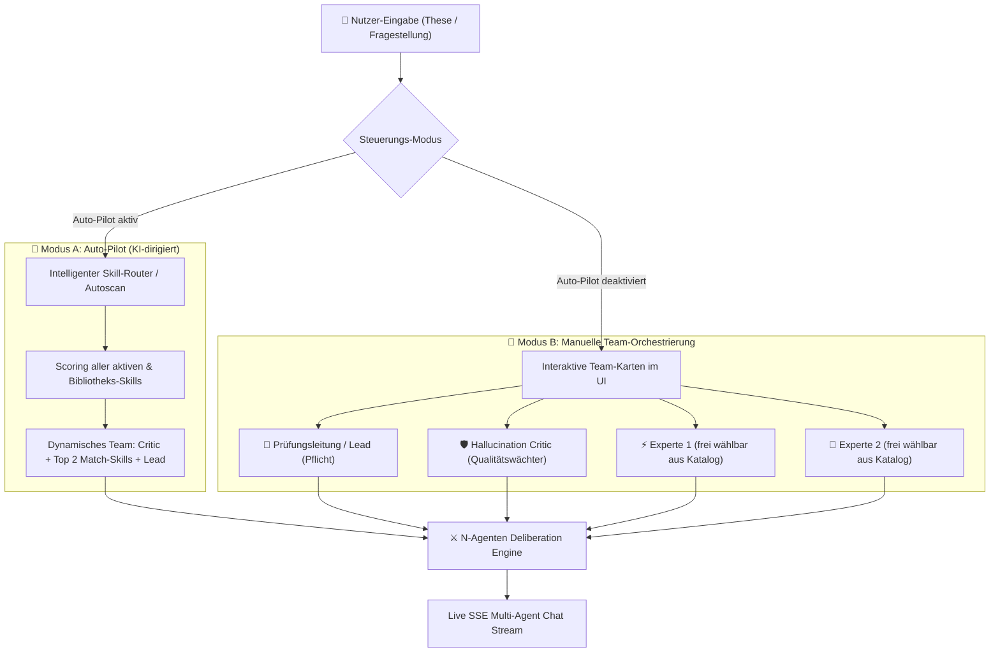
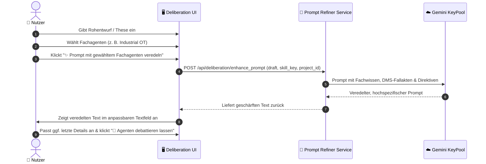

# 🎭 Case Studio Suite – Multi-Agenten Deliberation Studio: Dynamische Orchestrierung & Fachagenten-Prompt-Veredelung
**Datei:** `multi-agent-deliberation-plan.md`  
**Projekt:** Case Studio Suite (Standalone Docker auf Port `3088`)  
**Status:** Strategischer Architekturplan / Ausführungsbereit  
**Ziel-Sprints:** Sprint 9 bis Sprint 11  
**Vorbild & Referenz:** Legal Studio Orchestrierungs- & Veredelungs-Paradigma (siehe Screenshots)

---

## 📑 Inhaltsverzeichnis
1. [Ist-Zustands-Analyse & Strategische Vision](#1-ist-zustands-analyse--strategische-vision)
2. [Die zwei Steuerungs-Modi: Auto-Pilot vs. Manuelle Team-Zusammenstellung](#2-die-zwei-steuerungs-modi-auto-pilot-vs-manuelle-team-zusammenstellung)
3. [Fachagenten-Katalog & Kachel-Auswahl-Modal](#3-fachagenten-katalog--kachel-auswahl-modal)
4. [Fachagenten-Prompt-Veredelungs-Engine (Prompt Refiner)](#4-fachagenten-prompt-veredelungs-engine-prompt-refiner)
5. [Dynamische N-Agenten Deliberation-Pipeline (Backend-Refactoring)](#5-dynamische-n-agenten-deliberation-pipeline-backend-refactoring)
6. [Datenmodell-Erweiterung (SQLite WAL)](#6-datenmodell-erweiterung-sqlite-wal)
7. [UI/UX Wireframes & Glassmorphism-Layout](#7-uiux-wireframes--glassmorphism-layout)
8. [Sprint-Roadmap (Sprints 9 bis 11)](#8-sprint-roadmap-sprints-9-bis-11)
9. [Copy-Paste Prompts für den AI-Coding-Agenten](#9-copy-paste-prompts-für-den-ai-coding-agenten)
10. [Definition of Done & Human-in-the-Loop Test-Checkliste](#10-definition-of-done--human-in-the-loop-test-checkliste)

---

## 1. Ist-Zustands-Analyse & Strategische Vision

### 🔍 Der aktuelle Stand in der Suite (Sprint 1–4)
Bisher existiert im Tab *„Multi-Agenten Deliberation“* ein einfacher Eingabeschlitz mit dem Button **`Agenten debattieren lassen`**:
* **Hinter den Kulissen (`app/core/deliberation.py`):** Das System führt eine statische, 3-teilige Kette aus:
  1. *Hallucination Critic* (festes Prompting)
  2. *OT & Cloud Domain Specialist* (hart verdrahtet auf OPC UA, MQTT, Kafka und IEC 62443!)
  3. *Master-Consultant Lead* (Synthese & Mermaid-Graph)
* **Das Problem:** 
  1. Der Nutzer sieht nicht im Voraus, **wer** debattieren wird und **warum**.
  2. Bezieht sich die Fallstudie z. B. auf Genomforschung (`alphagenome` aus `scientific-agent-skills`) oder Datenbank-Skalierung (`spanner-basics` aus `googleskills`), antwortet dennoch fälschlicherweise der *OT & Cloud Specialist*.
  3. Der Nutzer hat **keine Kontrolle**, um gezielt eigene Experten aus der Skill-Library ins Team zu berufen oder gegeneinander antreten zu lassen.

### 🎯 Die Vision: Das Legal-Studio-Paradigma für technische Fallstudien
Inspiriert durch das bewährte Multi-Agenten-Orchester aus **Legal Studio** heben wir die Deliberation auf Enterprise-Niveau:
1. **Duales Steuerungs-Paradigma:**
   - **`Auto-Pilot (KI-dirigiert)`**: Die KI analysiert die Fragestellung und schaltet vollautomatisch die 2–3 passendsten Fachagenten aus der gesamten Skill-Library hinzu.
   - **`Manuelles Team`**: Der Nutzer stellt sein eigenes Spezialistenteam per Kachel-Auswahl zusammen (z. B. *Lead Strategist* + *Hallucination Critic* + *Siemens Industrial AI* + *Cloud Streaming*).
2. **Fachagenten-Prompt-Veredelung:**
   - Bevor eine komplexe Debatte oder Analyse gestartet wird, kann der Nutzer seine rohe Frage durch einen ausgewählten Fachagenten **vorab veredeln / schärfen lassen**.
   - Der Fachagent zieht DMS-Projektdokumente und sein Fachwissen heran, reichert den Entwurf mit exakten Kennwerten, Normen und Latenzzielen an und übergibt den veredelten Prompt in ein editierbares Textfeld.
3. **Volle Transparenz im Diskurs:**
   - Jeder Beitrag zeigt das Skill-Badge, die Rolle und die Begründung für die Intervention.

---

## 2. Die zwei Steuerungs-Modi: Auto-Pilot vs. Manuelle Team-Zusammenstellung



### Modus A: Auto-Pilot (KI-dirigiert)
* Standardmäßig aktiv (Toggle-Button: `[🤖 Auto-Pilot (KI-dirigiert): AKTIV]`).
* Bei Klick auf *„Agenten debattieren lassen“* führt das Backend einen **Autoscan** durch:
  1. Extraktion von Schlüsselthemen aus der Eingabe (z. B. „Latenz Frässpindel“, „Postgres Sharding“, „Deep Learning Protein-Folding“).
  2. Abgleich gegen alle aktivierten Projekt-Skills sowie die globale Library.
  3. Automatische Auswahl der 1–2 relevantesten Fachagenten.
  4. Anzeige im Chat: *„🤖 Auto-Pilot hat folgende Experten zugeschaltet: Industrial OT Specialist & Siemens AI Specialist“*.

### Modus B: Manuelle Team-Orchestrierung
* Wird aktiviert, sobald der Nutzer den Auto-Pilot-Toggle ausschaltet oder auf **`＋ Experte hinzufügen`** klickt.
* **Team-Kartenleiste im Header des Deliberation-Tabs:**
  - **Slot 1 (Pflicht):** *Master-Consultant Lead Strategist* (Synthese & Decision-Gate-Härtung).
  - **Slot 2 (Optional, standardmäßig aktiv):** *Hallucination Critic* (Skeptiker & Realitäts-Check).
  - **Slot 3 bis N (Dynamisch):** Fachagenten nach Wahl des Nutzers.
* **Aktionen pro Agenten-Karte:**
  - `[Ändern]`: Öffnet das Kachel-Auswahl-Modal zur Zuweisung eines anderen Skills.
  - `[Entfernen]`: Entfernt den Experten aus dem aktuellen Debattier-Team.
  - Statusanzeige: Skill-Name, Kategorie, Quell-Bibliothek.

---

## 3. Fachagenten-Katalog & Kachel-Auswahl-Modal

Analog zum Vorbild aus *Legal Studio* (Screenshot 4) erhält Case Studio ein großflächiges, intuitives Auswahl-Modal zur Team-Bestückung und Prompt-Veredelung.

```
┌─────────────────────────────────────────────────────────────────────────────────────────────┐
│ 🏛️ Fachagenten-Katalog & Kompetenzbereich wählen                                      [✕]   │
│ Über 300+ strukturierte Fachskills für Industrial OT, Cloud, AI & Science                  │
├─────────────────────────────────────────────────────────────────────────────────────────────┤
│ 🔍 Fachagent oder Stichwort eingeben... (z. B. OPC UA, GKE, Genom, Kafka, OEE, Latenz)      │
├─────────────────────────────────────────────────────────────────────────────────────────────┤
│ [# Alle (312)] [# Industrial OT & Edge] [# Cloud & Streaming] [# AI & Algorithmen]         │
│ [# Siemens Ecosystem] [# Scientific & Biotech] [# Data Engineering] [# Security & Normen]  │
├─────────────────────────────────────────────────────────────────────────────────────────────┤
│ ┌─────────────────────────┐ ┌─────────────────────────┐ ┌─────────────────────────┐        │
│ │ ⚡ INDUSTRIAL OT & EDGE   │ │ ☁️ CLOUD & STREAMING     │ │ 🔬 SCIENTIFIC BIOTECH   │        │
│ │ Industrial OT Specialist│ │ Cloud IoT Specialist    │ │ AlphaGenome Specialist  │        │
│ │ OPC UA, PROFINET, Real- │ │ MQTT, Kafka, Event-Hubs,│ │ DNA/RNA Variant Impact,│        │
│ │ time Edge Buffering     │ │ Lakehouse Telemetry     │ │ Chromatin Effects       │        │
│ │ [✓ Aktiviert]           │ │ [Wählen →]              │ │ [Wählen →]              │        │
│ └─────────────────────────┘ └─────────────────────────┘ └─────────────────────────┘        │
│ ┌─────────────────────────┐ ┌─────────────────────────┐ ┌─────────────────────────┐        │
│ │ 🏭 SIEMENS ECOSYSTEM    │ │ ❄️ DATA ENGINEERING     │ │ 🛡️ QUALITY & AUDIT      │        │
│ │ Siemens Industrial AI   │ │ Snowflake Data Engineer │ │ Hallucination Critic    │        │
│ │ Operations X, SIMATIC,  │ │ Iceberg, dbt, Large-    │ │ Latenz- & Kostenfallen, │        │
│ │ Industrial Edge Manager │ │ Scale IoT Lakehouse     │ │ Annahmen-Entlarvung     │        │
│ │ [Wählen →]              │ │ [Wählen →]              │ │ [✓ Im Team]             │        │
│ └─────────────────────────┘ └─────────────────────────┘ └─────────────────────────┘        │
├─────────────────────────────────────────────────────────────────────────────────────────────┤
│                                                                        [Schließen]          │
└─────────────────────────────────────────────────────────────────────────────────────────────┘
```

### Kernmerkmale des Modals:
* **Echtzeit-Suchfeld:** Filtert nach Name, Beschreibung, Tools und Tags ohne Latenz.
* **Kategorie-Pills:** Schnelles Umschalten zwischen Domänen (Industrie, Cloud, AI, Science).
* **Visuelle Kacheln:**
  - Farbiger Header-Badge der Domäne.
  - Titel & 2-zeilige Kompetenz-Zusammenfassung.
  - Statusanzeige: `[✓ Aktiviert]`, `[✓ Im Team]` oder `[Wählen →]`.
* **Zero Native Popups:** Vollständige Integration in das existierende Glassmorphism-Dark-Theme.

---

## 4. Fachagenten-Prompt-Veredelungs-Engine (Prompt Refiner)

Ein herausragendes Feature aus *Legal Studio* (Screenshots 3 & 5) ist die Möglichkeit, **Fragestellungen vor der Ausführung durch einen Fachagenten veredeln zu lassen**.

### Warum ist das in technischen Fallstudien entscheidend?
* **Problem:** Der Berater tippt oft nur stichpunktartig ein:  
  *„Wir wollen Fräsdaten in Snowflake laden und Anomalien erkennen.“*
* **Lösung durch Veredelung:** Der *Industrial OT & Edge Specialist* macht daraus automatisch:
  > *„Entwickle eine hybride Purdue-Level-Architektur für 120 Fräszentren: Hochfrequente 2kHz-Schwingungsdaten müssen an der SPS über Industrial Edge Geräte mittels OPC UA erfasst, lokal für <15ms Not-Abschaltungen aggregiert und vorverarbeitet werden. Nur aggregierte 1-Sekunden-Features (RMS, Peak-to-Peak) dürfen per MQTT/TLS an Kafka übergeben und zur OEE-Analyse in Snowflake persistiert werden. Berücksichtige dabei 48h-Offline-Puffer bei Netzwerkabriss und IEC 62443 Segmentierung.“*



### UI-Komponenten der Veredelung (oberhalb des Eingabefelds):
1. **Fachagenten-Selektor-Leiste:**
   - Zeigt den aktuell gewählten Veredler an (z. B. `🏭 Industrial OT & Edge Specialist`).
   - Button **`🔍 Autoscan (Top Fachagent)`** (erkennt automatisch den besten Agenten für das Thema).
   - Button **`🔍 Katalog durchsuchen ▾`** (öffnet das Kachel-Modal).
2. **Aktions-Button mit Live-Feedback:**
   - `✨ Prompt mit gewähltem Fachagenten generieren / veredeln`
   - Während der Generierung: Animierte Fortschritts-Pille  
     *`⏳ Fachagent analysiert Fallakten & reichert Prompt technisch an...`* (analog zu Screenshot 5).
3. **Editierbares Ziel-Textfeld (Section 3):**
   - Das Eingabefeld wird mit dem veredelten Prompt befüllt.
   - Der Nutzer behält die volle Kontrolle (**Human-in-the-Loop**) und kann Textteile vor dem Absenden anpassen.

---

## 5. Dynamische N-Agenten Deliberation-Pipeline (Backend-Refactoring)

Das Backend in `app/core/deliberation.py` wird von der starren 3er-Kette auf eine **dynamische N-Agenten-Pipeline** umgestellt:

### Ablauf der dynamischen Orchestrierung:
1. **Initialisierung & Team-Zusammenstellung:**
   - Wenn `auto_pilot = True`: Der `SemanticRouter` ermittelt die 1–2 passenden Skills anhand von Vektor-/Keyword-Übereinstimmung mit dem Projekt-DMS und der Frage.
   - Wenn `auto_pilot = False`: Es werden exakt die vom Nutzer konfigurierten Agenten-Slots geladen.
2. **Runde 1: Thesen-Prüfung & Skeptiker (Hallucination Critic):**
   - Prüft die These auf Machbarkeit, Bandbreiten, Latenzen, Kosten und blinde Annahmen.
3. **Runde 2 bis N-1: Fachexperten-Stellungnahmen:**
   - Jeder konfigurierte Fachagent antwortet nacheinander, bringt sein spezifisches Domänenwissen ein und löst die Kritikpunkte technisch auf.
4. **Runde N: Master-Consultant Synthese:**
   - Führt alle Stellungnahmen zusammen.
   - Generiert den gehärteten **Mermaid.js-Architekturgraphen**.
   - Extrahiert offene **Decision Gates** (`[DECISION_GATE]`), falls fundamentale Kundenfakten geklärt werden müssen.

---

## 6. Datenmodell-Erweiterung (SQLite WAL)

Zur dauerhaften Speicherung der Team-Zusammensetzung und der veredelten Prompts werden die Tabellen in SQLite erweitert:

```sql
-- 1. TEAM-KONFIGURATION PRO SESSION
CREATE TABLE IF NOT EXISTS session_deliberation_teams (
    id TEXT PRIMARY KEY,
    session_id TEXT REFERENCES case_sessions(id) ON DELETE CASCADE,
    auto_pilot INTEGER DEFAULT 1,          -- 1 = KI dirigiert, 0 = manuell
    configured_agents_json TEXT NOT NULL,  -- JSON-Array: [{"role": "critic", "skill_key": "..."}, ...]
    updated_at TIMESTAMP DEFAULT CURRENT_TIMESTAMP,
    UNIQUE(session_id)
);

-- 2. HISTORIE DER PROMPT-VEREDELUNGEN
CREATE TABLE IF NOT EXISTS prompt_refinements (
    id TEXT PRIMARY KEY,
    session_id TEXT REFERENCES case_sessions(id) ON DELETE CASCADE,
    original_draft TEXT NOT NULL,
    refined_prompt TEXT NOT NULL,
    used_skill_key TEXT NOT NULL,
    created_at TIMESTAMP DEFAULT CURRENT_TIMESTAMP
);
```

---

## 7. UI/UX Wireframes & Glassmorphism-Layout

Das überarbeitete Layout im Tab *„Multi-Agenten Deliberation“*:

```
┌─────────────────────────────────────────────────────────────────────────────────────────────┐
│ 👥 Dein aktives Agententeam  🟢 Orchestrator online        [🤖 Auto-Pilot (KI-dirigiert)]   │
│                                                            [＋ Experte hinzufügen]           │
├─────────────────────────────────────────────────────────────────────────────────────────────┤
│ ┌─────────────────────────────────────────────────────────────────────────────────────────┐ │
│ │ 👑 Prüfungsleitung (Master-Consultant Lead)        [Pflicht]   [⚡ Gemini 2.5 Flash]     │ │
│ │ Fachbereich: Executive Strategy & Architecture Review          [Ändern ▾]               │ │
│ └─────────────────────────────────────────────────────────────────────────────────────────┘ │
│ ┌─────────────────────────────────────────────────────────────────────────────────────────┐ │
│ │ 🛡️ Hallucination Critic & Architecture Validator   [Aktiv]     [⚡ Gemini 2.5 Flash]     │ │
│ │ Fachbereich: Quality Assurance & Failure Modes                 [Ändern ▾]  [✕ Entfernen]│ │
│ └─────────────────────────────────────────────────────────────────────────────────────────┘ │
│ ┌─────────────────────────────────────────────────────────────────────────────────────────┐ │
│ │ ⚡ Industrial OT & Edge Architecture Specialist    [Fachagent] [⚡ Gemini 2.5 Flash]     │ │
│ │ Fachbereich: Shopfloor, PLC, OPC UA & Real-time Buffering      [Ändern ▾]  [✕ Entfernen]│ │
│ └─────────────────────────────────────────────────────────────────────────────────────────┘ │
├─────────────────────────────────────────────────────────────────────────────────────────────┤
│                                                                                             │
│ [ CHAT-VERLAUF MIT SPRECHBLASEN & LIVE-STREAMING ]                                          │
│                                                                                             │
├─────────────────────────────────────────────────────────────────────────────────────────────┤
│ 🏛️ FACHAGENT FÜR PROMPT-VEREDELUNG                                                          │
│ [ 🏭 Industrial OT & Edge Specialist ▾ ]  [🔍 Autoscan (Top Fachagent)]  [🔍 Katalog]       │
│ [ ✨ Prompt mit gewähltem Fachagenten veredeln / schärfen                                 ] │
│                                                                                             │
│ 3. PROMPT & DISKUSSIONSTHESE (VOM USER ANPASSBAR)                                           │
│ ┌─────────────────────────────────────────────────────────────────────────────────────────┐ │
│ │ Wir wollen Fräsdaten in Snowflake laden und Anomalien erkennen...                       │ │
│ └─────────────────────────────────────────────────────────────────────────────────────────┘ │
│                                                         [ 🚀 Agenten debattieren lassen ]  │
└─────────────────────────────────────────────────────────────────────────────────────────────┘
```

---

## 8. Sprint-Roadmap (Sprints 9 bis 11)

```
┌────────────────────────────────────────────────────────────────────────────────────────┐
│               SPRINT-ROADMAP: DYNAMISCHES MULTI-AGENTEN DELIBERATION STUDIO            │
├────────────────────────────┬────────────────────────────┬──────────────────────────────┤
│ SPRINT 9                   │ SPRINT 10                  │ SPRINT 11                    │
│ Dynamische N-Agenten Engine│ Team-Orchestrierungs-UI &  │ Fachagenten-Prompt-Veredler  │
│ & Auto-Pilot Backend       │ Kachel-Auswahl-Modal       │ & End-to-End Orchestrierung  │
└────────────────────────────┴────────────────────────────┴──────────────────────────────┘
```

### Sprint 9: Dynamische N-Agenten Engine & Auto-Pilot Backend
* Backend-Refactoring von `app/core/deliberation.py` zur Ausführung beliebiger dynamischer Agenten-Listen.
* Implementierung des `SemanticRouter` für automatische Skill-Erkennung im Auto-Pilot-Modus.
* Neuer Endpunkt `POST /api/deliberation/detect_agents`.

### Sprint 10: Team-Orchestrierungs-UI & Kachel-Auswahl-Modal
* Bau der interaktiven Team-Banner-Komponente im Tab *„Multi-Agenten Deliberation“*.
* Umsetzung des Kachel-Auswahl-Modals (analog zu Screenshot 4) mit Domänen-Filtern und Suchleiste.
* Synchronisation der Team-Slots mit der SQLite-Datenbank.

### Sprint 11: Fachagenten-Prompt-Veredelung & End-to-End Orchestrierung
* Neuer Backend-Service `app/services/prompt_refiner.py` und API `POST /api/deliberation/enhance_prompt`.
* UI-Bereich für Prompt-Veredelung mit Fortschritts-Animation (`⏳ Fachagent veredelt...`).
* Vollständige Verifikation im Live-Container auf `http://localhost:3088`.

---

## 9. Copy-Paste Prompts für den AI-Coding-Agenten

Der folgende Master-Prompt kann direkt an den Developer-Agenten übergeben werden:

```text
Du bist als Senior Fullstack AI-Architect beauftragt, die Multi-Agenten Deliberation Suite zu erweitern.

ARBEITSGRUNDLAGE:
Lies die Spezifikation in 
`/Volumes/Spacestation/MCP/Antigravity-MCP-tools/Case-Studio/multi-agent-deliberation-plan.md` 
sowie das Handbuch in 
`/Volumes/Spacestation/MCP/Antigravity-MCP-tools/Case-Studio/how-to-case-studio.md`.

AUFGABE (Sprints 9 bis 11):
1. BACKEND DYNAMISCHE ORCHESTRIERUNG (app/core/deliberation.py & app/api/copilot.py):
   - Refactore 'run_multi_agent_deliberation' so, dass nicht mehr statisch 3 Agenten laufen, sondern ein dynamisches Team von N Agenten übergeben werden kann (Agenten-Definition: role, name, system_prompt, skill_key).
   - Implementiere den Auto-Pilot Autoscan: Bei 'auto_pilot = True' analysiert das Backend das Thema gegen alle aktiven Skills (und importierten Skills in /app/data/skills_catalog) und schaltet automatisch die 1–2 treffendsten Experten hinzu.
   - Implementiere den Endpunkt 'POST /api/deliberation/enhance_prompt': Liest das Skill-Wissen des gewählten Fachagenten und DMS-Dokumente aus und schärft den Nutzer-Rohentwurf zu einem präzisen, hochtechnischen Diskussions-Prompt.

2. UI TEAM-BANNER & AUTO-PILOT TOGGLE (app/static/index.html & app.js):
   - Baue oberhalb des Deliberation-Chats das Team-Dashboard (siehe Screenshot 2 & Wireframe):
     * Toggle: '🤖 Auto-Pilot (KI-dirigiert)' (aktiv / inaktiv).
     * Button: '＋ Experte hinzufügen'.
     * Karten-Slots: Lead Strategist [Pflicht], Critic [Qualitätsprüfer], Fachagent 1, Fachagent 2...
     * An jeder Karte Buttons für 'Ändern' und 'Entfernen'.

3. KACHEL-AUSWAHL-MODAL (app/static/index.html & app.js):
   - Erstelle das Fachagenten-Katalog Modal (siehe Screenshot 4):
     * Suchleiste & Kategorie-Filterchips (#Alle, #Industrial OT, #Cloud, #AI, #Science, #Siemens).
     * Responsives Grid von Skill-Kacheln mit Status ([Wählen →] / [✓ Im Team]).
     * Ermöglicht sowohl das Zuweisen zu einem Team-Slot als auch die Auswahl als Veredler.

4. FACHAGENTEN-PROMPT-VEREDELER IM UI (app/static/index.html & app.js):
   - Platziere über dem Eingabefeld die Sektion 'Fachagent für Prompt-Veredelung' (siehe Screenshot 3 & 5):
     * Anzeige des gewählten Fachagenten mit Dropdown/Katalog-Button.
     * Button '✨ Prompt mit gewähltem Fachagenten veredeln / schärfen'.
     * Fortschrittsanzeige während des API-Calls ('⏳ Fachagent analysiert Fallakten & reichert Prompt technisch an...').
     * Das Ergebnis wird direkt in das anpassbare Textfeld geschrieben.

🚨 ARBEITS- & TEST-REGELN (HUMAN-IN-THE-LOOP):
- Der Nutzer (Matthias) ist der finale Tester. Verschwende KEINE Tokens für lange simulierte Test-Skripte!
- Halte die Null-Native-Popups Regel strikt ein (kein alert(), kein confirm()).
- Baue den Container frisch: 'docker compose up -d --build case-studio-suite'.
- Committe alle Änderungen mit Conventional Commits ('feat(deliberation): ...') und pushe auf 'main' und 'develop'.
- Informiere Matthias mit einer klaren Test-Checkliste zur Abnahme im Browser (http://localhost:3088).
```

---

## 10. Definition of Done & Human-in-the-Loop Test-Checkliste

| Test-Fall | Erwartetes Verhalten |
|---|---|
| **Auto-Pilot Debatte** | Nutzer gibt z. B. eine Frage zu Genom-Analyse oder Cloud-Streaming ein. Der Auto-Pilot schaltet automatisch den passenden Spezialisten aus der Library zu. |
| **Manuelle Team-Zusammenstellung** | Nutzer deaktiviert den Auto-Pilot, klickt auf `[＋ Experte hinzufügen]`, wählt im Kachel-Modal einen Skill aus. Dieser erscheint als aktiver Slot im Team-Banner. |
| **Prompt-Veredelung** | Nutzer tippt eine kurze Stichpunkt-These ein und klickt auf `✨ Prompt mit gewähltem Fachagenten veredeln`. Nach 2–3 Sekunden steht ein hochspezifisch ausformulierter Prompt im Textfeld. |
| **Deliberation-Streaming** | Bei Klick auf `Agenten debattieren lassen` streamen alle im Team konfigurierten Agenten der Reihe nach sauber in den Chat. |
| **Persistenz** | Nach Neuladen der Seite (`F5`) bleibt das zusammengestellte Team für die aktuelle Session erhalten. |

---
*Erstellt für Matthias Köhler | Case Studio Suite 2026*
