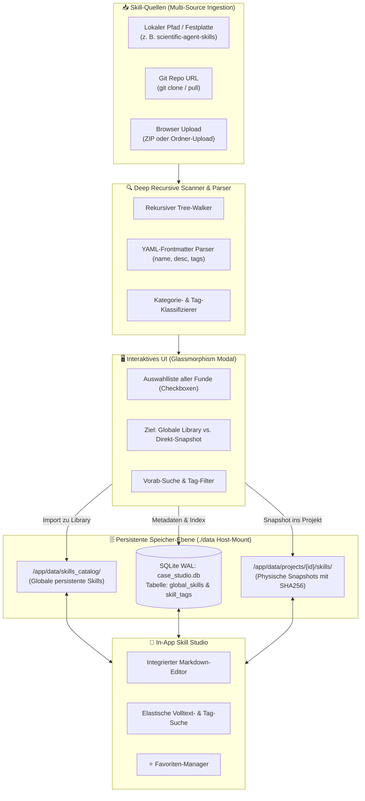

# 📚 Case Studio Suite – Skill-Erweiterungsplan: Custom Library, Deep-Scanner & Editor
**Datei:** `skill-erweiterungs-plan.md`  
**Projekt:** Case Studio Suite (Standalone Docker auf Port `3088`)  
**Status:** In Konzeption / Ausführungsbereit  
**Ziel-Sprints:** Sprint 5 bis Sprint 8  
**Bezugs-Repositories:**  
- `/Volumes/Spacestation/MCP/Antigravity-MCP-tools/scientific-agent-skills` (177 Research & Bio-Tech Skills)  
- `/Volumes/Spacestation/MCP/Antigravity-MCP-tools/googleskills` (130+ Cloud, AI & Assessment Skills)

---

## 📑 Inhaltsverzeichnis
1. [Management Summary & Motivation](#1-management-summary--motivation)
2. [Gesamtarchitektur & Persistenzmodell](#2-gesamtarchitektur--persistenzmodell)
3. [Datenmodell-Erweiterung (SQLite WAL)](#3-datenmodell-erweiterung-sqlite-wal)
4. [Sprint-Übersicht (Roadmap)](#4-sprint-übersicht-roadmap)
5. [Sprint 5: Persistente Library & Rekursiver Deep-Scanner](#5-sprint-5-persistente-library--rekursiver-deep-scanner)
6. [Sprint 6: Import-Center & Interaktives Multi-Selection-Modal](#6-sprint-6-import-center--interaktives-multi-selection-modal)
7. [Sprint 7: Integrierter In-App Markdown-Editor & Skill-Studio](#7-sprint-7-integrierter-in-app-markdown-editor--skill-studio)
8. [Sprint 8: Elastische Suche, Tag-System & Favoriten-Sterne](#8-sprint-8-elastische-suche-tag-system--favoriten-sterne)
9. [Copy-Paste Prompts für den AI-Coding-Agenten](#9-copy-paste-prompts-für-den-ai-coding-agenten)
10. [Qualitätsprüfung & Definition of Done (DoD)](#10-qualitätsprüfung--definition-of-done-dod)

---

## 1. Management Summary & Motivation

In der aktuellen Version (Sprint 1–4) verfügt die **Case Studio Suite** über einen festen, 6-teiligen Basiskatalog in `/app/skills_catalog`. Diese Standard-Skills decken grundlegende Beratungs- und Edge-Architekturen ab.

In realen technischen Due-Diligence-Prüfungen, Kunden-Pitches (z. B. Siemens Advanta) oder tiefen Architektur-Workshops werden jedoch hochgradig spezialisierte Fachexpertisen benötigt:
- **Wissenschaftliche & Algorithmen-Skills** (z. B. aus `scientific-agent-skills` mit 177 Modulen für RNA-Seq, Protein-Docking, Signalverarbeitung, ChemInformatik, PyTorch, Ray, etc.).
- **Cloud-, Infrastruktur- & Assessment-Skills** (z. B. aus `googleskills` mit 130+ Modulen für GKE-Troubleshooting, AlloyDB, BigQuery Lakehouse, Spanner, SecOps-Triage, etc.).
- **Individuelle Firmen- & Projekt-Skills**, die während eines Workshops formuliert oder angepasst werden müssen.

### Die Kernziele der Erweiterung:
1. **Multi-Source Ingestion:** Import von Skills entweder über Angabe eines lokalen Pfads auf der Festplatte (oder Docker-Mount), einer Git-Repository-URL oder direktem Upload (ZIP / Ordner-Upload im Browser).
2. **Deep Recursive Scanner:** Automatisches Durchforsten komplexer Verzeichnisbäume nach `SKILL.md` oder `.md`-Dateien, Extraktion von YAML-Frontmatter (`name`, `description`, `tags`, `category`) und Metadaten.
3. **Selektiver Import:** Vorschau aller gefundenen Skills im Dialog mit Checkboxen, Kategorisierung und Wahl des Zielbereichs (Globale persistente Bibliothek vs. direktes Projekt-Snapshotting).
4. **100 % Docker-Persistenz:** Sämtliche importierten Skills werden im Host-Mount `./data` abgelegt (`./data/skills_catalog/` und SQLite-Tabelle `global_skills`), sodass sie Container-Neustarts, Rebuilds und Löschungen unbeschadet überstehen.
5. **Integrierter Skill-Editor:** Vollwertiger Text- und Markdown-Editor im UI zur Anpassung von Prompt-Direktiven, Rollendefinitionen und Leitplanken.
6. **Elastische Suche, Tagging & Favoriten (⭐):** Sofortiges Auffinden nach Tags, Suchbegriffen und ein 1-Klick-Sternsystem für Lieblings-Skills.

---

## 2. Gesamtarchitektur & Persistenzmodell



### Persistenz-Garantie im Docker-Container
* Das Verzeichnis `./data` auf dem Host ist via `docker-compose.yml` auf `/app/data` gemountet.
* **Neues Verzeichnis:** `/app/data/skills_catalog/` speichert alle benutzerdefinierten und importierten Skills dauerhaft als physische Markdown-Dateien oder Ordner.
* **Fallback & Co-Existenz:** Der System-Katalog `/app/skills_catalog` (6 Basis-Skills) bleibt als Standard intakt; die Anwendung liest künftig **sowohl** den Systemkatalog als auch die persistente User-Bibliothek in `/app/data/skills_catalog/` aus.

---

## 3. Datenmodell-Erweiterung (SQLite WAL)

Um Tags, Favoriten, Herkunft und Versionierung sauber in SQLite abzubilden, wird das Schema um zwei neue Tabellen sowie Spalten-Erweiterungen ergänzt:

```sql
-- 1. GLOBALE SKILL-BIBLIOTHEK (Persistenter Katalog)
CREATE TABLE IF NOT EXISTS global_skills (
    id TEXT PRIMARY KEY,
    skill_key TEXT UNIQUE NOT NULL,       -- Eindeutiger Bezeichner (z. B. 'alphagenome')
    display_name TEXT NOT NULL,
    skill_category TEXT NOT NULL,         -- 'master_consultant', 'domain_specialist', 'critic_validator', 'research_analyst', 'tool_specialist'
    description TEXT,
    source_type TEXT NOT NULL,            -- 'system', 'local_folder', 'git_repo', 'user_created', 'zip_upload'
    source_origin TEXT,                   -- Ursprünglicher Pfad oder Repo-URL
    relative_path TEXT NOT NULL,          -- Pfad relativ zu /app/data/skills_catalog/
    version_hash TEXT,
    tags_csv TEXT,                        -- Kommagetrennte Tags z. B. 'bio,research,genomics'
    is_favorite INTEGER DEFAULT 0,        -- 1 = Stern aktiv
    is_built_in INTEGER DEFAULT 0,        -- 1 = unveränderlicher Basis-Skill
    created_at TIMESTAMP DEFAULT CURRENT_TIMESTAMP,
    updated_at TIMESTAMP DEFAULT CURRENT_TIMESTAMP
);

-- 2. SKILL-TAGS (FÜR ELASTISCHE FILTERUNG & CHIPS)
CREATE TABLE IF NOT EXISTS skill_tags (
    id TEXT PRIMARY KEY,
    skill_key TEXT NOT NULL,
    tag_name TEXT NOT NULL,
    UNIQUE(skill_key, tag_name),
    FOREIGN KEY(skill_key) REFERENCES global_skills(skill_key) ON DELETE CASCADE
);

-- 3. ERWEITERUNG DER BESTEHENDEN TABELLE: project_skills
-- Fügt Verweis auf Ursprung und Favoriten-Status hinzu
ALTER TABLE project_skills ADD COLUMN is_favorite INTEGER DEFAULT 0;
ALTER TABLE project_skills ADD COLUMN tags_csv TEXT;
ALTER TABLE project_skills ADD COLUMN last_edited_at TIMESTAMP;

-- Indizes für performante Volltext- und Tag-Suchen
CREATE INDEX IF NOT EXISTS idx_global_skills_category ON global_skills(skill_category);
CREATE INDEX IF NOT EXISTS idx_global_skills_favorite ON global_skills(is_favorite);
CREATE INDEX IF NOT EXISTS idx_skill_tags_tag ON skill_tags(tag_name);
```

---

## 4. Sprint-Übersicht (Roadmap)

```
┌────────────────────────────────────────────────────────────────────────────────────────┐
│                      SPRINT-ROADMAP: SKILL STUDIO & DEEP-SCANNER                       │
├───────────────────┬───────────────────┬───────────────────┬────────────────────────────┤
│ SPRINT 5          │ SPRINT 6          │ SPRINT 7          │ SPRINT 8                   │
│ Backend Scanner & │ Import Center &   │ In-App Markdown   │ Elastische Suche,          │
│ Persistenz-Layer  │ Multi-Selection   │ Editor & Studio   │ Tags & Favoriten (⭐)      │
└───────────────────┴───────────────────┴───────────────────┴────────────────────────────┘
```

---

## 5. Sprint 5: Persistente Library & Rekursiver Deep-Scanner

### 🎯 Ziel
Aufbau des Backend-Service, der beliebige Verzeichnisse, Git-Repositories und ZIP-Dateien nach Skills scannt, Frontmatter extrahiert und die Speicherung in `./data/skills_catalog` persistent vorhält.

### 📋 Kern-Features:
1. **Schema Migration:** Automatisches Anlegen von `global_skills` und `skill_tags` beim Start.
2. **Scanner-Service (`app/services/skill_scanner.py`):**
   - Traversiert Verzeichnisse rekursiv bis Tiefe 8.
   - Erkennt `SKILL.md` (Standard für Antigravity / Claude Code) sowie Einzel-Markdown-Dateien (`*.md`).
   - Extrahiert YAML-Frontmatter (Titel, `description`, `allowed-tools`, `metadata.tags`, `category`).
   - Fallback-Heuristik: Erkennt Kategorie und Kurzbeschreibung aus Markdown-Überschriften, falls kein YAML-Header existiert.
3. **Git-Ingestor & Path-Resolver:**
   - Erlaubt Scannen lokaler Pfade (z. B. auf gemounteten Volumes) oder `git clone --depth 1` in ein temporäres Import-Verzeichnis.
4. **Seed-Migration:** Automatisches Einlesen der bestehenden 6 System-Skills in die neue SQLite-Tabelle `global_skills`.

### 🔗 Neue API-Endpunkte:
- `POST /api/skills/scan` (Payload: `{ "source_type": "local_path"|"git_url", "source_path": "..." }`) ➔ Liefert Liste gefundener Skills mit Metadaten.
- `GET /api/skills/library` (Filterbar nach Kategorie, Tag, Favoriten, Suchbegriff).
- `POST /api/skills/import` (Payload: `{ "selected_skills": [...], "target": "library"|"project", "project_id": "..." }`).

---

## 6. Sprint 6: Import-Center & Interaktives Multi-Selection-Modal

### 🎯 Ziel
Ein ansprechendes UI-Modul im Tab *„Skill-Katalog & Snapshots“*, über das der Nutzer Quellen angeben, gefundene Skills im Detail inspizieren und flexibel importieren kann.

### 📋 Kern-Features:
1. **Skill-Upload & Ingestion Header:**
   - Button **`📥 Skills importieren / hinzufügen`** im Tab-Header.
   - Öffnet ein vollflächiges Glassmorphism-Modal.
2. **Quellenauswahl (Tabs im Modal):**
   - **Option A (Lokaler Pfad):** Eingabefeld für Verzeichnispfad auf dem Rechner oder Server (z. B. `/Volumes/Spacestation/MCP/Antigravity-MCP-tools/scientific-agent-skills`).
   - **Option B (Git Repository):** Eingabe einer Git-Clone-URL mit optionaler Branch-Angabe.
   - **Option C (Datei- / Ordner-Upload):** Drag & Drop für `.zip`-Archive oder WebKit-Ordnerauswahl direkt im Browser.
3. **Interaktive Scan-Ergebnisliste:**
   - Schnelle Fortschrittsanzeige ("Scanne 177 Skills in scientific-agent-skills...").
   - Tabelle/Karten aller Funde mit Checkboxen:
     - Checkbox | Skill Name | Kategorie | Kurzbeschreibung | Gefundene Tags | Dateigröße
   - Schnellauswahl-Aktionen: *„Alle auswählen (177)“*, *„Keine auswählen“*, *„Nur Research & Bio“*.
4. **Ziel-Auswahl & Import:**
   - Radio-Option:
     - 🔘 *„In die dauerhafte Globale Skill-Library importieren“* (steht allen künftigen Projekten zur Verfügung).
     - 🔘 *„Direkt als physischer Snapshot ins aktuelle Projekt einbinden“*.
     - 🔘 *„Beides gleichzeitig durchführen“*.
   - Klick auf **`🚀 Import ausführen`** kopiert die Dateien physisch nach `/app/data/skills_catalog/` und indiziert sie in SQLite.

---

## 7. Sprint 7: Integrierter In-App Markdown-Editor & Skill-Studio

### 🎯 Ziel
Ein direkter Text- und Markdown-Editor, mit dem bestehende oder neu importierte Skills ohne Verlassen der Plattform angepasst, erweitert oder als Variante neu gespeichert werden können.

### 📋 Kern-Features:
1. **Skill-Detail & Editor-Modal:**
   - Jede Skill-Karte (im Katalog oder bei den Projekt-Snapshots) erhält einen **`✏️ Bearbeiten`**-Button.
   - Neuer Button **`＋ Eigenen Skill erstellen`** im Katalog-Header.
2. **Editor-Funktionen:**
   - Zwei Spalten: Links Markdown-Code-Editor mit Zeilennummern, rechts Live-HTML-Vorschau.
   - Metadaten-Leiste: Skill-Name, Display-Name, Kategorie-Dropdown, Komma-getrennte Tags.
   - Reversible Snapshot-Änderungen:
     - Wird ein Skill in den Projekt-Snapshots editiert, wird nur die projekteigene Kopie in `/app/data/projects/{id}/skills/` aktualisiert und der SHA256-Hash neu berechnet.
     - Wird ein globaler Skill editiert, wird die Datei in `/app/data/skills_catalog/` aktualisiert.
3. **Sicherheits-Leitplanken:**
   - Basis-Skills (`is_built_in = 1`) werden bei Bearbeitung automatisch als *Kopie / Duplikat* abgespeichert (z. B. `hallucination_critic_custom.md`), um das System-Template nicht zu beschädigen.

### 🔗 Neue API-Endpunkte:
- `GET /api/skills/{skill_key}/content` ➔ Liefert Roh-Markdown und Metadaten.
- `PUT /api/skills/{skill_key}` ➔ Aktualisiert Datei und Datenbank.
- `POST /api/skills/create` ➔ Legt einen komplett neuen Skill an.

---

## 8. Sprint 8: Elastische Suche, Tag-System & Favoriten-Sterne

### 🎯 Ziel
Höchste Bedienbarkeit auch bei hunderten importierten Skills (aus `scientific-agent-skills` und `googleskills`) durch eine reaktionsschnelle, filterbare Oberfläche mit Tag-Pills und Favoriten-Manager.

### 📋 Kern-Features:
1. **Elastische Suchleiste (Realtime-Filter):**
   - Sofortige Filterung während des Tippens (Debounce 150ms).
   - Durchsucht Titel, Beschreibungen, Tags und Skill-Inhalte.
2. **Interaktive Tag-Cloud (Pills):**
   - Horizontale Scroll-Leiste mit dynamisch generierten Tags (z. B. `#all`, `#favorites`, `#research`, `#bio`, `#cloud`, `#gke`, `#ot`, `#siemens`, `#security`, `#database`).
   - Klick auf ein Tag filtert die Liste sofort.
3. **Favoriten-Sternefunktion (⭐):**
   - Jede Karte hat einen Favoriten-Stern oben rechts (gelb ausgefüllt = Favorit, grau umrandet = normal).
   - 1-Klick auf den Stern persistiert den Status sofort in der SQLite-Datenbank (`is_favorite = 1/0`).
   - Schnell-Filter-Chip: **`⭐ Favoriten`** zeigt nur die wichtigsten Arbeitswerkzeuge.
4. **Verfeinerte Kartendarstellung:**
   - Badge für Herkunft (`System`, `Importiert: scientific-skills`, `Custom`).
   - Tag-Chips auf der Karte.
   - Button **`📥 Im Projekt snapshotten`** mit Erfolgs-Feedback (Häkchen-Animation).

---

## 9. Copy-Paste Prompts für den AI-Coding-Agenten

Die folgenden Prompts können direkt nacheinander an den Agenten übergeben werden, um die Sprints autonom und fehlerfrei umzusetzen.

---

### 🤖 AGENT PROMPT: SPRINT 5 (Scanner, Persistenz & Datenmodell)

```text
Du bist als Senior Backend Architect beauftragt, Sprint 5 der Case Studio Suite umzusetzen.

AUFGABE:
Implementiere die persistente Skill-Library und den rekursiven Deep-Scanner für Skill-Repositories wie 'scientific-agent-skills' und 'googleskills'.

SCHRITTE:
1. DATENBANK (app/db/schema.py & repositories.py):
   - Ergänze die SQLite-Tabellen 'global_skills' und 'skill_tags' gemäß Kapitel 3 aus 'skill-erweiterungs-plan.md'.
   - Führe eine Migration/Seed durch: Lies beim Start alle bestehenden Markdown-Dateien aus settings.resolved_skills_catalog_dir aus und trage sie als 'is_built_in = 1' in 'global_skills' ein.
   - Füge Hilfsfunktionen in 'repositories.py' hinzu für: get_global_skills (mit Filter nach category, search, tag, is_favorite), upsert_global_skill, toggle_favorite_skill, add_skill_tags.

2. DEEP SCANNER SERVICE (app/services/skill_scanner.py):
   - Erstelle 'skill_scanner.py' mit der Funktion 'scan_directory_for_skills(target_path: Path)'.
   - Der Scanner muss Verzeichnisse rekursiv durchsuchen und sowohl 'SKILL.md' (Ordner-basierte Skills wie in scientific-agent-skills/googleskills) als auch einzelne '*.md'-Dateien erkennen.
   - Parse YAML-Frontmatter ('name', 'description', 'allowed-tools', 'category', 'tags') oder leite diese intelligent aus Überschriften (# Title, ## Role Definition) ab.
   - Berechne SHA256-Hash und Dateigröße.

3. PERSISTENZ IN ./data:
   - Stelle sicher, dass benutzerdefinierte und importierte Skills in '/app/data/skills_catalog/' gespeichert werden (gemountet auf Host-Ordner ./data/skills_catalog).
   - Passe 'app/config.py' so an, dass 'resolved_data_skills_catalog_dir' auf '/app/data/skills_catalog' verweist und dieses Verzeichnis automatisch erstellt wird.

4. API-ROUTER (app/api/skills.py):
   - POST /api/skills/scan -> nimmt JSON { "source_path": str } entgegen, validiert den Pfad und gibt die Liste gefundener Skills zurück.
   - POST /api/skills/import -> nimmt { "skills": [...], "target": "library"|"project", "project_id": Optional[str] } entgegen, kopiert die Dateien nach /app/data/skills_catalog/ und/oder /app/data/projects/{id}/skills/ und indiziert sie in SQLite.
   - GET /api/skills/library -> liefert alle registrierten globalen Skills inklusive Tags und Favoriten-Status.
   - POST /api/skills/{skill_key}/favorite -> schaltet das Favoriten-Flag (0/1) um.

5. VERIFIKATION:
   - Rebuild und teste im Docker-Container:
     docker compose up -d --build case-studio-suite
   - Prüfe per curl den Scan des lokalen Repos:
     curl -s -X POST http://localhost:3088/api/skills/scan -H "Content-Type: application/json" -d '{"source_path": "/Volumes/Spacestation/MCP/Antigravity-MCP-tools/scientific-agent-skills"}' | head -n 30
   - Bestätige, dass keine bestehenden Tests oder Endpunkte beschädigt wurden.
```

---

### 🤖 AGENT PROMPT: SPRINT 6 (Import-Center UI & Auswahldialog)

```text
Du bist als Senior Fullstack UI/UX Engineer beauftragt, Sprint 6 der Case Studio Suite umzusetzen.

AUFGABE:
Baue die grafische Skill-Upload- und Import-Area im Tab 'Skill-Katalog & Snapshots' inklusive interaktivem Multi-Selection-Modal.

VORGABEN:
- Strikte Einhaltung der UI-Regeln: Null native Browser-Popups (kein alert(), kein confirm()), ausschließlich Glassmorphism Dark UI mit CSS-Tokens (--bg-card, --cyan, --violet, etc.) und Non-Blocking Toasts.
- Responsive Bedienbarkeit auch bei 100+ Scan-Treffern.

SCHRITTE:
1. INDEX.HTML (app/static/index.html):
   - Erweitere den rechten Panel-Header in '#tab-skills' um einen Action-Button:
     '<button id="btn-open-skill-import" class="btn btn-primary btn-sm">📥 Skills importieren / hinzufügen</button>'.
   - Erstelle das Import-Modal ('#skill-import-modal-overlay') mit Glassmorphism-Design:
     * Header mit Titel und Schließen-Button (&times;).
     * Quellenauswahl (Tabs oder Radio: Lokaler Pfad / Festplatte, Git Repository URL, ZIP-Upload).
     * Eingabefeld für den Pfad (z. B. vorbefüllt mit Beispielpfaden zu scientific-agent-skills oder googleskills).
     * Button '🔍 Verzeichnis scannen'.
     * Fortschritts-Spinner und Scan-Zusammenfassung ('177 Skills in scientific-agent-skills gefunden').
     * Such- und Filterleiste innerhalb der Scan-Ergebnisse.
     * Scrollbare Tabelle mit Checkboxen, Skill-Name, Kategorie, Kurzbeschreibung und Tags.
     * Batch-Buttons: 'Alle auswählen', 'Auswahl aufheben'.
     * Ziel-Auswahl: 'In Globale Library importieren' vs. 'Ins aktuelle Projekt snapshotten'.
     * Footer mit 'Abbrechen' und '🚀 Ausgewählte Skills importieren (X)'.

2. JAVASCRIPT LOGIK (app/static/js/app.js & api.js):
   - Füge in 'api.js' Aufrufe für 'scanSkills(path)' und 'importSkills(payload)' hinzu.
   - Implementiere in 'app.js' die Event-Handler für das Modal, das Scannen, das Filtern und den Batch-Import.
   - Nach erfolgreichem Import: Zeige einen Erfolgs-Toast an ('12 Skills erfolgreich importiert!'), schließe das Modal und aktualisiere die Skill-Listen im Katalog und im Projekt.

3. DOCKER-VERIFIKATION:
   - Führe 'docker compose up -d --build case-studio-suite' aus.
   - Öffne 'http://localhost:3088' und teste das Scannen von:
     '/Volumes/Spacestation/MCP/Antigravity-MCP-tools/scientific-agent-skills'
   - Wähle 3 Skills aus (z. B. 'alphagenome', 'rdkit', 'polars-bio'), importiere sie und verifiziere, dass sie im globalen Katalog erscheinen.
```

---

### 🤖 AGENT PROMPT: SPRINT 7 (In-App Markdown-Editor & Skill-Studio)

```text
Du bist als Senior Fullstack Engineer beauftragt, Sprint 7 der Case Studio Suite umzusetzen.

AUFGABE:
Entwickle den integrierten In-App Markdown-Editor für Skills, damit Benutzer Skills direkt in der Suite modifizieren, feinschleifen oder neue Skills erstellen können.

SCHRITTE:
1. BACKEND (app/api/skills.py & app/services/skill_service.py):
   - Endpunkt 'GET /api/skills/{skill_key}/content': Liest den Roh-Inhalt der Markdown-Datei aus (entweder aus dem Projekt-Snapshot oder der globalen Library).
   - Endpunkt 'PUT /api/skills/{skill_key}': Speichert die aktualisierte Markdown-Datei, aktualisiert den Hash und synchronisiert Metadaten in SQLite.
   - Endpunkt 'POST /api/skills/custom': Erstellt eine neue Skill-Datei in '/app/data/skills_catalog/' und registriert sie in 'global_skills'.
   - Schutz von Basis-Skills: Wird versucht, einen 'is_built_in = 1' Skill zu überschreiben, erzeugt das Backend automatisch eine modifizierte Benutzer-Kopie (z. B. '{skill_key}_custom.md').

2. FRONTEND EDITOR MODAL (app/static/index.html & app.js):
   - Baue ein großflächiges Editor-Modal ('#skill-editor-modal-overlay') mit:
     * Metadaten-Feldern: Display-Name, Kategorie-Dropdown (Master Consultant, Domain Specialist, Critic/Validator, Research Analyst, Tool Specialist), Tags (kommagetrennt).
     * Split-View: Links Monospace Textarea mit Zeilennummern / Syntax-Feeling, rechts formatierte Live-Vorschau.
     * Buttons: 'Abbrechen', 'Als neuer Skill speichern', 'Änderungen speichern'.
   - Ergänze an jeder Skill-Karte einen Edit-Button ('✏️').
   - Ergänze im Katalog-Header einen Button '＋ Neuer Skill'.

3. TEST & BUILD:
   - Führe 'docker compose up -d --build case-studio-suite' aus.
   - Öffne einen Skill (z. B. 'alphagenome'), passe die Leitplanken im Editor an, speichere und prüfe, ob der Snapshot im Projekt exakt den neuen Text enthält.
```

---

### 🤖 AGENT PROMPT: SPRINT 8 (Elastische Suche, Tag-System & Favoriten)

```text
Du bist als UI/UX Specialist und Performance Engineer beauftragt, Sprint 8 der Case Studio Suite umzusetzen.

AUFGABE:
Implementiere die elastische Echtzeit-Suche, das Tag-Filtersystem und die Favoriten-Sternefunktion (⭐) für den Skill-Katalog.

SCHRITTE:
1. FAVORITEN-SYSTEM:
   - Backend: Stelle sicher, dass 'POST /api/skills/{skill_key}/favorite' den Status in SQLite umschaltet und zurückgibt.
   - Frontend: Platziere an jeder Skill-Karte oben rechts ein interaktives Stern-Icon (⭐ / ☆).
   - Klick auf den Stern triggert sofort den API-Call und aktualisiert das UI ohne Neuladen der Seite.

2. ELASTISCHE SUCHE & TAG-FILTERUNG:
   - Füge über dem globalen Skill-Katalog eine Suchleiste ein:
     '<input type="text" id="skill-search-input" class="form-input" placeholder="🔍 Skills durchsuchen (z. B. Bio, Edge, Python, GKE, Latenz)...">'
   - Erstelle eine horizontale Tag-Leiste mit dynamischen Chips:
     * '#Alle', '⭐ Nur Favoriten', '#research', '#bio', '#cloud', '#ot', '#siemens', '#security', etc.
   - Live-Filterung: Beim Tippen oder Klick auf ein Tag wird die Skill-Liste verzögerungsfrei (Debounce 150ms) gefiltert.
   - Trefferanzahl-Badge anzeigen (z. B. 'Zeige 14 von 183 Skills').

3. SNAPSHOT-SYNCHRONISATION:
   - Verbessere die Projekt-Snapshot-Karten: Zeige auch dort die Tags und einen Schnell-Entfernen-Button ('🗑️ Snapshot lösen').
   - Zeige bei bereits im Projekt gesicherten Skills im globalen Katalog ein grünes Badge '✓ Gesnapshottet'.

4. VERIFIKATION:
   - Container neu bauen: docker compose up -d --build case-studio-suite
   - Prüfe mit 50+ importierten Skills aus scientific-agent-skills und googleskills:
     * Funktioniert die Suche nach 'genom' oder 'gke'?
     * Werden Favoriten nach Container-Neustart korrekt beibehalten?
```

---

## 10. Qualitätsprüfung & Definition of Done (DoD)

Ein Sprint gilt erst als abgeschlossen, wenn alle nachfolgenden Kriterien erfüllt sind:

| Kriterium | Prüfverfahren | Soll-Ergebnis |
|---|---|---|
| **Container-Persistenz** | Container mit `docker compose down` stoppen, mit `docker compose up -d --build` neu starten | Alle importierten Skills, Favoriten-Sterne und Tags sind in `http://localhost:3088` unverändert vorhanden. |
| **Lokales Scannen** | Pfad `/Volumes/Spacestation/MCP/Antigravity-MCP-tools/scientific-agent-skills` scannen | Alle 177 Skills werden innerhalb von < 3 Sekunden gefunden und im Modal sauber gelistet. |
| **Frontmatter-Parsing** | Skill `alphagenome` oder `gke-basics` inspizieren | Name, Beschreibung und Tags werden korrekt aus YAML extrahiert. |
| **Zero Native Popups** | Alle Interaktionen (Löschen, Importieren, Fehler) testen | Ausschließlich Glassmorphism-Modals und Non-Blocking Toasts; null `window.alert()` / `confirm()`. |
| **Prompt-Integration** | Gesnapshotteten Skill im Projekt aktivieren und im Copiloten Stream anstoßen | Der Volltext des importierten Skills wird in den Prompt-Kontext kompiliert und vom Gemini-Model referenziert. |
| **Git Backup** | Änderungen commiten und pushen | Clean Tree auf `main` & `develop` mit Conventional Commits (`feat(skills): ...`). |

---
*Erstellt für Matthias Köhler | Case Studio Suite 2026*
