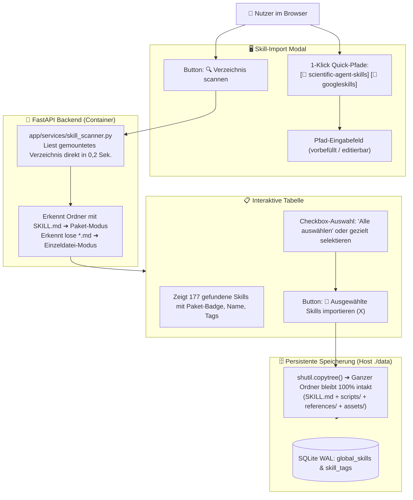

# 📦 Case Studio Suite – Skill-Package Scanner & Import Architektur-Fix
**Datei:** `skill-package-scanner-fix-plan.md`  
**Projekt:** Case Studio Suite (Standalone Docker auf Port `3088`)  
**Status:** Dringender Architektur-Fix / Ausführungsbereit  
**Ziel:** 
1. Beseitigung der Browser-Sicherheitsabfrage (*„Sollen 2.027 Dateien hochgeladen werden?“*) durch direkte Server-Pfad-Verarbeitung ohne WebKit-Upload.
2. Vollständige Wahrung der **Skill-Paket-Integrität**: Skills sind ganze Ordner (mit `SKILL.md`, `scripts/`, `references/`, `assets/`), die intakt kopiert werden müssen, statt Skripte/Subordner fehlerhaft zu löschen oder zu ignorieren.
3. 100 % generische Logik – **Null Hardcoding** von Beispiel-Skillnamen.

---

## 📑 Inhaltsverzeichnis
1. [Ursachen-Analyse des Fehlers](#1-ursachen-analyse-des-fehlers)
2. [Was ist ein echter Agent-Skill? (Paket-Anatomie)](#2-was-ist-ein-echter-agent-skill-paket-anatomie)
3. [Die neue Import-Architektur: Server-Pfad statt Browser-Upload](#3-die-neue-import-architektur-server-pfad-statt-browser-upload)
4. [Backend-Refactoring (Scanner & Package-Copy)](#4-backend-refactoring-scanner--package-copy)
5. [Frontend-Korrektur (Modal ohne Browser-Dateiupload)](#5-frontend-korrektur-modal-ohne-browser-dateiupload)
6. [Copy-Paste Prompt für den Developer-Agenten](#6-copy-paste-prompt-für-den-developer-agenten)
7. [Human-in-the-Loop Test-Checkliste](#7-human-in-the-loop-test-checkliste)

---

## 1. Ursachen-Analyse des Fehlers

### Problem A: Der Browser fragt nach „2.027 Dateien hochladen“
* **Was der Developer fälschlicherweise eingebaut hat:**  
  Ein HTML-Input `<input type="file" webkitdirectory>` hinter dem Button *„Ordner im Finder auswählen...“*.
* **Warum das scheitert:**  
  Wenn man im Finder den Ordner `scientific-agent-skills/skills` auswählt, versucht der Web-Browser, alle 2.027 einzelnen Dateien (Python-Skripte, Templates, Git-Objekte, JSON-Dateien) nacheinander über HTTP in den Browser-Speicher zu laden. Der Browser stoppt dies sofort mit einem nativen Sicherheits-Dialog:  
  *„Sollen 2.027 Dateien auf diese Website hochgeladen werden?“*
* **Die richtige Lösung:**  
  Der Ordner `/Volumes/Spacestation/MCP/Antigravity-MCP-tools/` ist über `docker-compose.yml` bereits direkt in den Container gemountet (`/Volumes/Spacestation/MCP/Antigravity-MCP-tools:/Volumes/Spacestation/MCP/Antigravity-MCP-tools:ro`)!  
  Das System benötigt **keinen Browser-Upload**, sondern liest den Pfad direkt auf dem Dateisystem aus. Der Nutzer gibt lediglich den Pfad an (oder wählt einen 1-Klick Quick-Pfad).

### Problem B: Skripte und Unterordner wurden fälschlicherweise ignoriert
* **Was der Developer fälschlicherweise eingebaut hat:**  
  Ein Banner *„Sicherer Skill-Filter: Ignoriert Skripte (.sh, .py), Konfigurationen, Readmes...“* und im Code wurde nur ein einzelnes flaches `f"{skill_key}.md"` abgespeichert.
* **Warum das den Skill zerstört:**  
  Ein moderner Agent-Skill (z. B. `treatment-plans` oder `waypoint-bio`) besteht nicht nur aus einem Markdown-Text. Er besitzt ausführbare Python-Skripte in `scripts/`, Prompt-Vorlagen in `assets/` und Leitfäden in `references/`. Wird nur die `SKILL.md` kopiert, ist der Skill unvollständig und funktionsunfähig!

### Problem C: Hardcoding von Democode
* Der Developer-Agent darf keine festen Skill-Namen (wie `treatment-plans`, `what-if-oracle`) hart in das Modal einprogrammieren. Die Erkennung muss zu 100 % dynamisch für jedes beliebige Verzeichnis funktionieren.

---

## 2. Was ist ein echter Agent-Skill? (Paket-Anatomie)

In Antigravity, Claude Code und modernen Agenten-Systemen existieren zwei Ausprägungen:

```
AUSPRÄGUNG 1: Vollwertiges Skill-Paket (Ordner-basiert, 90% der Fälle)
skills/
└── treatment-plans/               <── Das Skill-Paket
    ├── SKILL.md                   <── Manifest, YAML-Frontmatter & Hauptinstruktion
    ├── scripts/                   <── Python/Bash-Tools des Skills
    │   └── validate_plan.py
    ├── references/                <── Domänen-Wissen & Richtlinien
    │   └── clinical_guidelines.md
    └── assets/                    <── Templates & JSON-Schemas
        └── transition_manifest.json

AUSPRÄGUNG 2: Standalone Markdown-Skill (Einzeldatei)
skills_catalog/
└── ot_edge_architecture.md        <── Einzelne Markdown-Datei
```

### Die goldene Regel für den Import:
* Wenn ein Ordner eine `SKILL.md` enthält, ist dieser Ordner ein **unteilbares Paket**.
* Beim Import in die Bibliothek `/app/data/skills_catalog/` sowie beim Snapshot ins Projekt `/app/data/projects/{id}/skills/` muss der **gesamte Ordner mit allen Unterordnern und Dateien intakt kopiert werden** (`shutil.copytree`).

---

## 3. Die neue Import-Architektur: Server-Pfad statt Browser-Upload



---

## 4. Backend-Refactoring (Scanner & Package-Copy)

### 4.1 Scanner-Modell (`app/services/skill_scanner.py`)
Jeder gefundene Skill liefert folgende Metadaten:
```python
{
    "skill_key": "treatment-plans",
    "display_name": "Treatment Plans",
    "skill_category": "research_analyst",
    "description": "Evidence-based clinical decision support...",
    "tags": ["clinical", "research", "health"],
    "is_package": True,                       # True = Ordner mit Sub-Elementen
    "package_path": "/Volumes/.../skills/treatment-plans",
    "manifest_file": "/Volumes/.../skills/treatment-plans/SKILL.md",
    "sub_elements": ["scripts (1)", "references (2)", "assets (6)"],
    "total_files": 10,
    "file_size": 24500
}
```

### 4.2 Intakter Paket-Import (`app/services/skill_service.py`)
```python
async def import_scanned_skills(skills_data, target="library", project_id=None):
    for item in skills_data:
        skill_key = item["skill_key"]
        is_package = item.get("is_package", False)
        src_path = Path(item["package_path" if is_package else "manifest_file"])
        
        # 1. Zielordner in /app/data/skills_catalog/
        if is_package:
            dest_dir = settings.resolved_data_skills_catalog_dir / skill_key
            if dest_dir.exists():
                shutil.rmtree(dest_dir)
            # Kopiert den GESAMTEN Ordner inklusive scripts/, references/, assets/!
            shutil.copytree(src_path, dest_dir)
            manifest_path = dest_dir / "SKILL.md"
            relative_path = f"{skill_key}/SKILL.md"
        else:
            dest_file = settings.resolved_data_skills_catalog_dir / f"{skill_key}.md"
            shutil.copy2(src_path, dest_file)
            manifest_path = dest_file
            relative_path = f"{skill_key}.md"
            
        # 2. SQLite Registrierung
        # ...
```

---

## 5. Frontend-Korrektur (Modal ohne Browser-Dateiupload)

Im Modal in `app/static/index.html` und `app/static/js/app.js`:

1. **Entfernen:** Der fehlerhafte versteckte `<input type="file" webkitdirectory>` und der Button *„Ordner im Finder auswählen...“* werden **vollständig entfernt**.
2. **Ersetzen durch:**
   * **Pfad-Eingabezeile mit 1-Klick Quick-Pfade:**
     ```html
     <div class="quick-path-row">
       <span style="font-size:0.75rem; color:#94a3b8;">Schnellauswahl:</span>
       <button type="button" class="btn-quick-path" data-path="/Volumes/Spacestation/MCP/Antigravity-MCP-tools/scientific-agent-skills">
         📁 scientific-agent-skills
       </button>
       <button type="button" class="btn-quick-path" data-path="/Volumes/Spacestation/MCP/Antigravity-MCP-tools/googleskills">
         📁 googleskills
       </button>
     </div>
     <div style="display:flex; gap:8px; margin-top:8px;">
       <input type="text" id="scan-path-input" class="gate-answer-input" 
              placeholder="Pfad eingeben (z. B. /Volumes/Spacestation/MCP/Antigravity-MCP-tools/scientific-agent-skills)" style="flex:1;" />
       <button id="btn-start-skill-scan" class="btn btn-primary btn-sm">
         🔍 Verzeichnis scannen
       </button>
     </div>
     ```
3. **Banner-Korrektur:**  
   Entfernen des irreführenden Hinweises, dass Skripte ignoriert werden. Stattdessen:  
   *`📦 Intakter Paket-Import: Erkennt vollständige Skill-Ordner inklusive aller Skripte, Referenzen und Templates.`*

---

## 6. Copy-Paste Prompt für den Developer-Agenten

```text
Du bist als Senior Fullstack Engineer beauftragt, den Skill-Scanner und Import-Mechanismus der Case Studio Suite zu korrigieren.

PROBLEMSTELLUNG:
1. Aktuell löst der Button 'Ordner im Finder auswählen...' eine Browser-Sicherheitswarnung aus ('Sollen 2.027 Dateien hochgeladen werden?'). Das ist unbrauchbar und überfordert den Nutzer. Der Container hat den Host-Pfad '/Volumes/Spacestation/MCP/Antigravity-MCP-tools' bereits gemountet!
2. Skills sind keine einzelnen losen Markdown-Dateien, sondern vollständige Verzeichnispakete mit 'SKILL.md' plus Unterordnern ('scripts/', 'references/', 'assets/'). Der bisherige Code hat diese Unterordner fälschlicherweise ignoriert und nur eine einzelne .md-Datei abgespeichert. Dadurch werden Skills funktionsunfähig!
3. Es darf KEIN Democode oder feste Skill-Namen hardcodiert werden.

ARBEITSGRUNDLAGE:
Lies die Spezifikation in:
`/Volumes/Spacestation/MCP/Antigravity-MCP-tools/Case-Studio/skill-package-scanner-fix-plan.md`.

AUFGABEN:
1. FRONTEND BEREINIGUNG (app/static/index.html & app/static/js/app.js):
   - Entferne '<input type="file" webkitdirectory>' und den Button 'Ordner im Finder auswählen...' komplett.
   - Baue die Pfad-Eingabe mit Quick-Path-Buttons aus Kapitel 5 ein:
     * Quick-Button 1: '/Volumes/Spacestation/MCP/Antigravity-MCP-tools/scientific-agent-skills'
     * Quick-Button 2: '/Volumes/Spacestation/MCP/Antigravity-MCP-tools/googleskills'
     * Text-Eingabefeld '#scan-path-input' und Button '🔍 Verzeichnis scannen'.
   - Bei Klick auf einen Quick-Button wird der Pfad ins Eingabefeld übernommen und sofort der Scan ausgelöst.
   - Korrigiere das Infobanner: '📦 Intakter Paket-Import: Erkennt vollwertige Skill-Pakete mit SKILL.md, Skripten und Referenzen.'

2. SCANNER-SERVICE (app/services/skill_scanner.py):
   - Der Scanner durchsucht den übergebenen Pfad.
   - Wenn ein Ordner eine 'SKILL.md' (case-insensitive) enthält:
     * Markiere ihn als 'is_package = True'.
     * Speichere den Ordnerpfad 'package_path' (z. B. '.../skills/treatment-plans') und die 'manifest_file' ('.../SKILL.md').
     * Zähle gefundene Subordner (z. B. 'scripts', 'references', 'assets') und liste sie in den Scan-Metadaten auf.
     * Stoppe das weitere Absteigen in die Unterordner dieses Skills.
   - Parse YAML-Frontmatter aus der 'SKILL.md' (Titel, Beschreibung, Tags, Kategorie).

3. INTAKTER PAKET-IMPORT (app/services/skill_service.py):
   - In 'import_scanned_skills':
     * Wenn 'is_package = True': Kopiere das gesamte Verzeichnis mit 'shutil.copytree' nach '/app/data/skills_catalog/{skill_key}/'.
     * Wenn 'is_package = False': Kopiere die einzelne .md-Datei nach '/app/data/skills_catalog/{skill_key}.md'.
     * Speichere den relativen Pfad ('{skill_key}/SKILL.md' bzw. '{skill_key}.md') in SQLite 'global_skills'.
   - In 'activate_skill_for_project':
     * Wenn der Skill ein Ordner-Paket in der Library ist, kopiere den gesamten Ordner nach '/app/data/projects/{project_id}/skills/{skill_key}/'.
     * Registriere den Pfad zur 'SKILL.md' in SQLite 'project_skills'.
   - In 'get_active_skills_content':
     * Liest die 'SKILL.md' des jeweiligen Pakets aus und hängt bei Bedarf eine Übersicht der verfügbaren Skripte/Referenzen an den Prompt an.

🚨 TEST- & ARBEITSREGELN (HUMAN-IN-THE-LOOP):
- Matthias ist der finale Tester. Verschwende KEINE Tokens für simulierte Tests.
- Baue den Container frisch: 'docker compose up -d --build case-studio-suite'.
- Committe mit Conventional Commits ('fix(skills): implement intact package scanning and eliminate browser file upload prompt') und pushe auf 'main' und 'develop'.
- Informiere Matthias mit einer kurzen Test-Checkliste zur Abnahme im Browser (http://localhost:3088).
```

---

## 7. Human-in-the-Loop Test-Checkliste

| Prüfschritt | Erwartetes Ergebnis |
|---|---|
| **Keine Browser-Warnung** | Klick auf Quick-Path `scientific-agent-skills` ➔ Der Browser zeigt **keine** Warnung (*„2.027 Dateien hochladen“*). |
| **Schneller Scan** | Nach < 1 Sekunde erscheint: *„177 Skills in scientific-agent-skills gefunden“*. |
| **Paket-Integrität** | Einen Skill mit Skripten (z. B. `treatment-plans` oder `what-if-oracle`) importieren. |
| **Dateisystem-Prüfung** | Im Container unter `/app/data/skills_catalog/treatment-plans/` liegen `SKILL.md`, `scripts/`, `references/` und `assets/` vollständig und intakt vor. |
| **Projekt-Snapshot** | Klick auf *„Im Projekt snapshotten“* ➔ Das gesamte Paket liegt unter `/app/data/projects/{id}/skills/treatment-plans/`. |

---
*Erstellt für die Case Studio Suite 2026*
